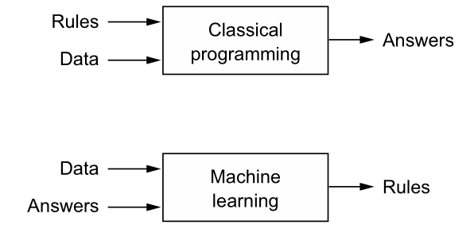
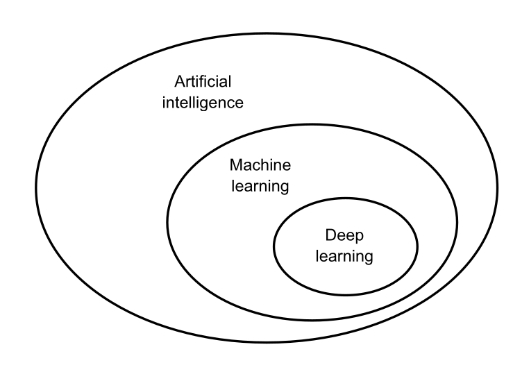
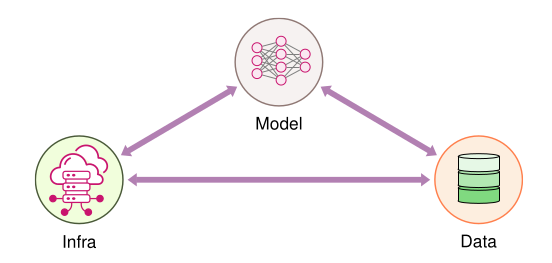

# Introduction

What this lecture covers:**

- How ML systems differ from traditional software systems
- How we arrived at the current paradigm of AI
- The three pillars every ML system stands on: data, algorithms, infrastructure
- The Bitter Lesson — and what it means for how we build systems today

---

## Software Engineering systems vs Machine Learning systems



In **traditional programming**, a human writes explicit rules:

```
Data + Rules  →  Program  →  Answers
```

In **machine learning**, we invert the process — the machine derives the rules from examples:

```
Data + Answers  →  Training  →  Rules (Model)
```

This inversion has deep consequences for how the resulting systems behave:

| Aspect | Software Engineering | Machine Learning Systems |
|---|---|---|
| **Logic** | Written explicitly by humans | Learned from data |
| **Correctness** | Deterministic; testable against a spec | Statistical; evaluated against metrics (accuracy, precision, recall) |
| **Failure mode** | Crashes, exceptions — loud failures | Silent degradation — the system keeps running but predictions get worse |
| **Source of truth** | The code | The code **and** the data **and** the model |
| **Change over time** | Behaves the same until code changes | Degrades as the world drifts away from the training data |
| **Debugging** | Stack traces, breakpoints | Data audits, error analysis, ablations |
| **Versioning** | Version the code | Version code + data + model + hyperparameters |

**Key takeaway:** in ML systems, *data is code*. A bug can live in the dataset, in a feature pipeline, or in a stale model — not just in the source files. Testing, monitoring, and deployment practices must all be rethought accordingly.

---

## Evolution of AI



AI has evolved through distinct eras, each one arising to fix the limitations of the last — and each one delegating *more* of the work to data and computation.

### 1. Symbolic AI (1956 – mid-1970s)

- Born at the **Dartmouth Conference (1956)**, where McCarthy, Minsky, Rochester, and Shannon coined the term "artificial intelligence." Core assumption: intelligence = symbol manipulation.
- **STUDENT (1964)** solved algebra word problems by parsing English into equations; **ELIZA (1966)** simulated conversation via pattern matching and substitution — no learning, no data, running on 256KB mainframes.
- **Fatal flaw — brittleness:** these systems only handled inputs that exactly matched their pre-programmed patterns. Any minor variation broke them completely, so deployment beyond the lab was infeasible.
- *Systems footnote:* the Dartmouth pioneers underestimated the resources intelligence requires by roughly a **million-fold** — they assumed 1950s hardware (≤64KB memory) would suffice; modern models need hundreds of GB and exaflops of compute. Algorithmic cleverness alone was never going to be enough.

### 2. Expert Systems (mid-1970s – 1980s)

- The field retreated from "general AI" to capturing *expert knowledge in narrow domains*.
- **MYCIN (Stanford, 1975)** diagnosed blood infections with ~600 hand-written IF-THEN rules carrying certainty factors.
- Three problems it exposed that **still haunt ML today**:
    1. **Knowledge capture** — experts often can't articulate how they decide
    2. **Uncertainty handling** — rules cope poorly with incomplete information
    3. **Maintenance** — new rules conflicted with old ones as the rule base grew

### 3. Statistical Learning (1990s)

- Shift from hand-coded rules to **learning patterns from data**, enabled by three converging factors: the digital revolution (data), Moore's law (compute), and new algorithms (SVMs, improved neural networks).
- Canonical example — **spam filtering**: instead of writing `IF contains("viagra") THEN spam` (easily evaded), learn from thousands of examples that certain words appear in 90% of spam but 1% of normal mail, and combine the evidence with **Naive Bayes**: `P(spam|word) = P(word|spam) × P(spam) / P(word)`
- Three concepts introduced here remain central to all of ML:
    1. **Training data quality/quantity matters as much as the algorithm**
    2. **Rigorous evaluation metrics** are needed to measure and compare systems
    3. **Precision vs recall trade-offs** must be chosen per application (a spam filter tolerates some spam; a medical screen must not miss cases)

### 4. Shallow Learning (2000s)

- One or two processing layers ("shallow" vs deep): **decision trees** (interpretable, tiny footprint), **k-NN**, **linear/logistic regression**, and **SVMs** with the kernel trick (project data into higher dimensions where classes become linearly separable).
- The recipe was **hybrid**: human-engineered features + statistical learner. A 2005 computer-vision pipeline: extract SIFT/HOG features by hand → select features → train an SVM → post-process.
- Strengths: solid mathematical foundations, worked with limited data, computationally cheap, reproducible.
- **Viola-Jones face detection (2001)**: simple rectangular features + a cascade of classifiers that rejects easy negatives early — real-time detection (24 fps) on 2001 hardware, powering digital-camera face detection for a decade. An early masterclass in *algorithm–hardware co-design*.

### 5. Deep Learning (2012 –)

- Instead of hand-engineering features, stack layers of simple units that learn **increasingly abstract representations**: edges → shapes/textures → parts (whiskers, ears) → concepts ("cat").
- **AlexNet (ImageNet 2012)** was the watershed: trained on two GTX 580 GPUs (60M parameters, ~6 days, ~1,287 GPU-hours), it scored **15.3% top-5 error vs 26.2%** for the runner-up — a 42% relative improvement.
- The ideas were *old* — Rosenblatt's **perceptron (1957)**, **backpropagation (1986)**, LeCun's digit recognition (1989) — but they stagnated for decades because three ingredients were missing: **enough data, enough compute, and training techniques for deep networks**. 2012 was a *convergence*, not a sudden invention.
- The breakthrough was as much **systems engineering as algorithms**: GPU parallelism, memory-bandwidth-aware design, and frameworks (Theano and successors) providing automatic differentiation at scale.

### 6. Foundation Models (2018 –)

- Scale exploded: **GPT-3 (2020)** has 175B parameters (~350GB), a **500x jump over BERT-Large** (340M, 2018), trained on 1,024 V100 GPUs over weeks at an estimated **$4.6M** cost.
- **Emergent abilities** appeared from scale alone — fluent text, conversation, code generation — not from explicit programming.
- Systems challenges now dominate: distributed training across thousands of GPUs, serving 100GB+ models to millions of users at sub-second latency, and datasets so large (LAION-5B: ~240TB) that data loading itself becomes a distributed-systems problem. Hence *model-as-a-service*: providers like OpenAI serve APIs instead of shipping models.

### The arc of the story

| | Symbolic AI | Expert Systems | Statistical Learning | Shallow / Deep Learning |
|---|---|---|---|---|
| **Key strength** | Logical reasoning | Domain expertise | Versatility | Pattern recognition |
| **Data needed** | Minimal | Expert knowledge | Moderate | Large-scale |
| **Adaptability** | Fixed rules | Domain-specific | Cross-domain | Highly adaptable |
| **Problem complexity** | Simple, logic-based | Complicated, domain-specific | Complex, structured | Highly complex, unstructured |

**Two takeaways:**

1. **Hand-coded intelligence → learned intelligence.** Each era replaced more human-encoded knowledge with patterns learned from data — trading brittleness for flexibility, and computational simplicity (ELIZA on 256KB) for infrastructure intensity (GPT-3's GPU fleets).
2. **Every major advance required an algorithmic breakthrough AND a systems breakthrough.** Perceptrons waited 50 years for their hardware; AlexNet needed GPUs and autograd frameworks; GPT-3 needed distributed training infrastructure. That pairing — and the engineering discipline it demands — is exactly what this course is about.

---

## Machine learning systems
Machine Learning Systems are integrated computing systems comprising three interdependent components:   
- data that guides behavior,   
- algorithms that learn patterns, and   
- computational infrastructure that enables both
training and inference.




### 1. Data
- Collection, labelling, cleaning, versioning
- Feature pipelines and feature stores
- Quality: garbage in → garbage out, *at scale*
- Drift: the world changes; your training set doesn't

### 2. Algorithms
- Model selection, training, and tuning
- Evaluation: offline metrics vs online (business) metrics
- Trade-offs: accuracy vs latency vs interpretability vs cost

### 3. Infrastructure
- Compute for training (GPUs/TPUs, distributed training)
- Serving: batch vs online inference, latency budgets
- Orchestration, CI/CD for models, experiment tracking
- Monitoring and observability in production

> **A system is only as strong as its weakest pillar.** A state-of-the-art model on bad data is useless; a great model that can't be served within the latency budget never ships.

Most academic ML focuses on the **algorithms** pillar. Most *industry* effort — and most of this course — lives in the other two.

---

## The Bitter Lesson

In his 2019 essay, Rich Sutton looked back at 70 years of AI research and drew a provocative conclusion:

> General methods that leverage computation are ultimately the most effective, and by a large margin.

**The recurring story:**

1. Researchers build in human knowledge — hand-crafted rules, features, heuristics. It helps in the short term.
2. Approaches based on **search and learning**, scaled with more compute and data, eventually win — decisively.
3. The human-knowledge approach, once beaten, turns out to have been a *ceiling*, not a foundation.

### 30 years of the Bitter Lesson in NLP

The same pattern has repeated roughly every 3–4 years:

| Era | The "human knowledge" approach | The "compute + data" winner |
|---|---|---|
| **1990s** | Rule-based machine translation (SYSTRAN): linguists hand-wrote grammar and transfer rules for decades | Statistical MT (IBM's Candide, early 1990s): learn word alignments from millions of sentence pairs of parallel parliamentary text — no linguist needed |
| **2000s** | Feature-engineered NLP: every task needed dozens of hand-crafted features (`isCapitalized`, gazetteers, POS tags…) | Word2Vec (2013) / GloVe (2014): predict neighboring words on billions of tokens; representations learn themselves |
| **2010s** | Task-specific architectures: tree-LSTMs for parsing, CRFs for NER, custom attention for QA | Transformer (2017): one general architecture + scale displaced them within a few years |
| **2020s** | Domain-specific pretraining: BloombergGPT, Galactica, BioGPT, LegalBERT | GPT-4-class general models: train on everything, then prompt or RAG — match or beat domain models on most of their own benchmarks |
| **Now** | Fine-tune per task with thousands of labeled examples | Instruction tuning + RLHF: one general model handles many tasks from a few examples in the prompt |

### Case study: BloombergGPT vs GPT-4 (both March 2023)

- **BloombergGPT** — the *domain expert* bet: 50B parameters trained from scratch on a ~700B-token corpus, roughly half curated financial data (news, filings, Bloomberg data) and half general text. "Finance is special; bake the knowledge in."
- **GPT-4** — the *bitter lesson* bet: general model trained on essentially everything, no financial knowledge deliberately baked in. Just prompt it: *"You are a financial analyst. Here are 10 SEC filings…"*

**Outcome:** In its own paper, BloombergGPT clearly beat similarly-sized general models (GPT-NeoX, OPT-66B, BLOOM-176B) on financial benchmarks — the domain bet worked *against its peers*. But an independent follow-up study ([Li et al. 2023](https://arxiv.org/abs/2305.05862)) found BloombergGPT performed only about as well as zero-shot ChatGPT and **below GPT-4 on most financial tasks** — a general model with no financial pretraining and no access to Bloomberg's data.

**Why the general model won:**

1. **Generalization + scale beat specialization** — GPT-4 read vastly more text (including plenty of public finance) and found the patterns itself.
2. **Compute beat curation effort** — millions spent curating a finance corpus lost to more compute on a general model.
3. **Maintenance** — financial knowledge changes; a specialized model goes stale, while a general model + retrieval can be fed tomorrow's 10-K filings tomorrow.

**The nuance — when specialized still wins:**

- **Domain-heavy tasks** — the same study found GPT-4 still lagged on financial NER and some sentiment tasks, where domain-specific knowledge matters most
- **Data privacy** — client data that can't leave the building favors an on-prem specialized model
- **Cost & latency** — a 50B model is far cheaper to serve than a frontier model for thousands of internal queries per day

So the lesson is not "specialized models are useless" — it's that *given enough compute and general data, the general model usually wins.*

### What it means for ML system engineers

- **Domain knowledge isn't useless — hard-coding it into the model is what loses.** Let the model learn from data, and supply domain knowledge *at runtime* via RAG and tools instead of baking it into weights.
- Don't over-invest in hand-tuned heuristics that the next scale-up replaces
- Do invest in what compounds with scale: **data pipelines, evaluation harnesses, compute infrastructure**
- The durable skill isn't a particular model architecture — it's the ability to build systems that can absorb *the next* wave of models

📖 Read the original: [The Bitter Lesson — Rich Sutton (2019)](http://www.incompleteideas.net/IncIdeas/BitterLesson.html)

---

## References & Further Reading

- Vijay Janapa Reddi, [*Machine Learning Systems*](https://mlsysbook.ai) — Chapter 1: Introduction
- Rich Sutton, [*The Bitter Lesson*](http://www.incompleteideas.net/IncIdeas/BitterLesson.html) (2019)
- Chip Huyen, *Designing Machine Learning Systems* (O'Reilly, 2022)
- D. Sculley et al., [*Hidden Technical Debt in Machine Learning Systems*](https://papers.nips.cc/paper/5656-hidden-technical-debt-in-machine-learning-systems) (NeurIPS 2015)
- Andrej Karpathy, [*Software 2.0*](https://karpathy.medium.com/software-2-0-a64152b37c35) (2017)
