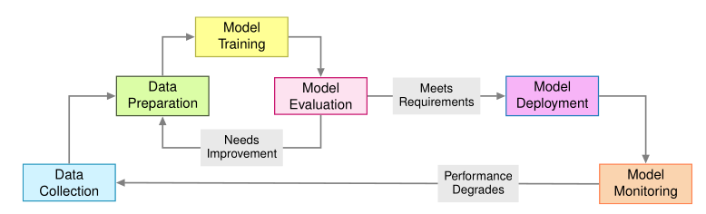
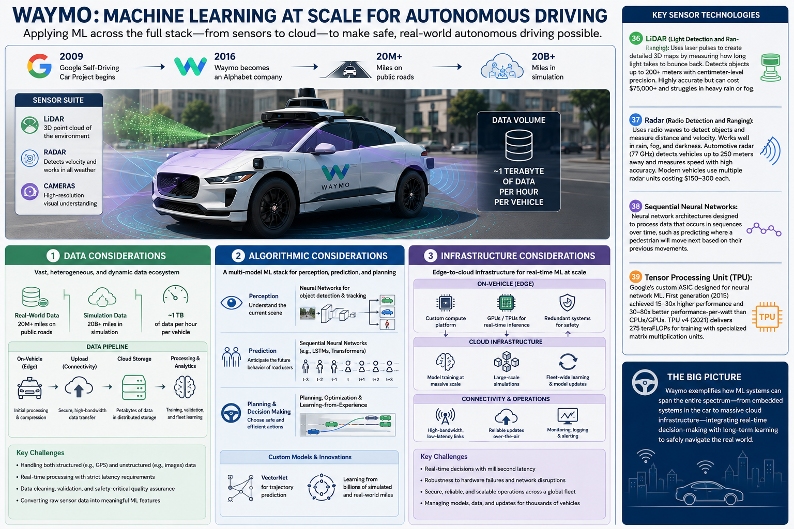

## Tradiditional Software Engineering  
  Design -> Implementation -> Testing -> Deployment

  - **Version control**: track changes to code over time
  - **CI/CD pipelines**: automate the build, test, and deployment process
  - **Test automation**: run automated tests to catch bugs and regressions
  - **Static code analysis**: analyze code for potential bugs and security vulnerabilities

## Machine Learning lifecycle  
  data collection → training → evaluation → deployment → monitoring → retraining   
  
Image credits: MLSys book

  - **Data & model versioning** — version data, models, and hyperparameters alongside code (DVC, model registries)
  - **Experiment tracking** — log every run's config, metrics, and artifacts so results are reproducible and comparable (MLflow, W&B)
  - **Data validation** — automated checks on schema, distributions, and quality before data reaches training (Great Expectations, TFDV)
  - **Automated evaluation** — test models against benchmark suites and behavioral tests before promotion, not just accuracy on one held-out set
  - **CI/CD/CT pipelines** — continuous integration and deployment extended with *continuous training*: retrain and revalidate automatically as new data arrives
  - **Feature stores** — share consistent, versioned features between training and serving, avoiding training/serving skew
  - **Staged rollouts** — shadow deployments, canary releases, and A/B tests before a model takes full traffic
  - **Monitoring & drift detection** — track prediction quality, data drift, and concept drift in production; alert and trigger retraining

  
## Case study: Waymo self-driving initiative

Image credits: ChatGPT

### Data considerations
- Each Waymo vehicle generates approximately _one terabyte per vehicle per hour_ of data in structured as well as unstructured format coming from LiDAR, Radar and other high resolution cameras.

### Algorithmic considerations
- Specialized models for perception (object detection, lane detection, etc.)
- Prediction models like [vectornet](https://waymo.com/blog/2020/05/vectornet/) to anticipate the behavior of other users//vehicles

## Infrastructure considerations
- Custom designed infrastructure on device for making real time predictions.
- Extensive use of cloud infrastructure for data collection, storage, processing, and efficient access during training.

## Core challenges  
### Data challenges  
  - **Data quality**: Data originates from human or machine sources, and may be noisy, incomplete, or biased. 
  - **Data scale**: The volume of data available for training can be enormous, requiring distributed computing and efficient data pipelines.
  - **Data drift**: The gradual change in the statistical properties of input data over time, which can degrade model performance if not properly monitored and addressed through retraining or model updates.  
  Eg: For self driving cars:
    - Seasonal variations affect sensor performance through changing sun angles and precipitation patterns.
    - Infrastructure modifications alter road layouts.
    - Urban growth evolves traffic patterns.
    - Each shift can degrade specific model components: pedestrian detection accuracy may decline in winter conditions, while lane following confidence may decrease on newly repaved roads.
    - Detecting these shifts requires continuous monitoring of input distributions and model performance across operational contexts.

### Model challenges  
- Models require enormous computing power to train and run, making it difficult to deploy them in situations with
  limited resources, like on mobile phones or IoT devices.  
  [Transfer learning](https://en.wikipedia.org/wiki/Transfer_learning) can help mitigate this challenge by leveraging pre-trained models and fine-tuning them on new data.

### Ethical challenges
- Fairness, as ML systems can sometimes learn to make decisions that discriminate against certain groups of people.
- Transparency and interpretability, as ML models can be opaque and difficult to understand, leading to trust issues and ethical concerns.
- Privacy, as ML models often require access to sensitive data, leading to concerns about data privacy and security.

## References
1. - Vijay Janapa Reddi, [*Machine Learning Systems*](https://mlsysbook.ai) — Chapter 1: Introduction
2. [Vectornet: Waymo](https://waymo.com/blog/2020/05/vectornet/)
