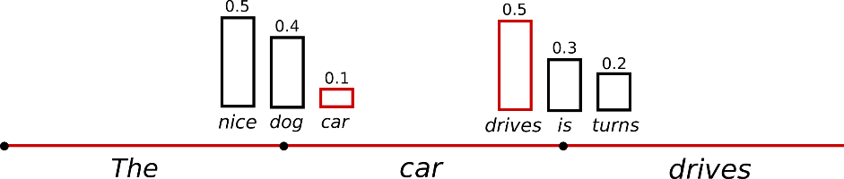
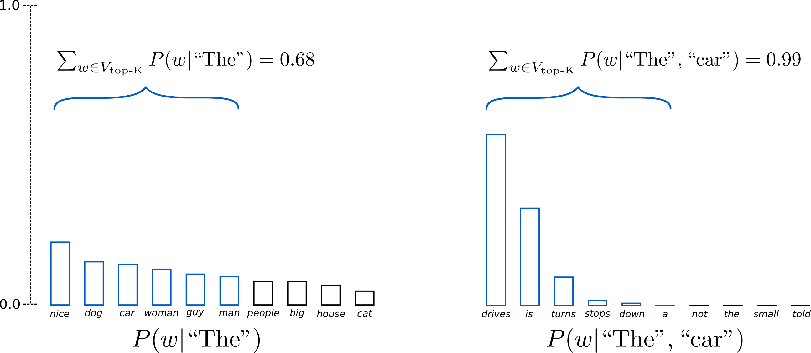

# Decoding strategies

> **Module thesis:** a language model does not generate text — it emits **one probability distribution over the vocabulary, once per step**. Everything you recognise as "generation" — coherent prose, creative variation, repetitive loops, hallucinated confidence — is produced by the **decoding strategy**, the deterministic-or-random rule that turns that distribution into a token. Same weights, different rule, different text.

Lectures 11/12 covered what a model is on disk. These notes are about the last inch of inference: the model has produced its logits — **now what?**

**The arc:** the next-token distribution → greedy search → beam search → sampling with temperature → top-k → nucleus (top-p). Each strategy exists because the previous one fails on a concrete class of text.

---

> **Prerequisite (revision):** these notes pick up where the forward pass ends — at the **logits**. If you need the transformer recap (embeddings, attention, and the LM head that produces `vocab_size` logits + softmax), read [Transformer architecture — a revision](Transformer_architecture_revision.md) first.

---

## 1. Text generation fundamentals

Generation is a loop around the forward pass:

```text
while not done:
    logits = model(tokens)          # one forward pass → vocab_size scores
    probs  = softmax(logits[-1])    # distribution over the NEXT token
    next   = select(probs)          # ← the decoding strategy lives here
    tokens.append(next)
```

Three facts about this loop carry the whole lecture:

- **One forward pass buys exactly one distribution.** The model never proposes a sentence — only the next token, every time.
- **`select()` is not part of the model.** The weights are frozen; swap the selection rule and the same model writes different text. Every strategy below is a different `select()`.
- **The loop feeds on its own output.** The chosen token becomes context for the next step, so one bad choice does not stay one bad choice — it conditions everything after it.

### Sequence probability

The probability of a whole sequence is the product of its per-step conditionals:

$$P(w_1, \ldots, w_n) = \prod_{i=1}^{n} P(w_i \mid w_1, \ldots, w_{i-1})$$

A product of numbers below 1 shrinks fast: a 100-token continuation where every step is a confident $P = 0.5$ still has sequence probability $2^{-100}$. **Every long text is individually improbable** — so "pick probable text" cannot mean "pick text with high absolute probability"; it can only mean choosing well *relative to the alternatives at each step*.

### The two families

| Family | Rule | Members |
| --- | --- | --- |
| **Deterministic search** | maximise (approximately) sequence probability | greedy, beam search |
| **Stochastic sampling** | draw from the (reshaped) distribution | temperature, top-k, top-p |

!!! question "💬 The model outputs the same distribution every time for the same context. Where does the variety in ChatGPT's answers come from?"

    ??? hint "Answer"
        From `select()`, not from the model. The forward pass is a deterministic function of the context; the sampler draws a random token from the distribution it returns. Set temperature to 0 (greedy) and the variety disappears — same prompt, same answer, same weights either way. (Serving engines add a second, unintended source — batching and floating-point non-associativity — but that is noise, not design.)

---

## 2. Greedy search

The simplest `select()`: **take the argmax at every step.** Deterministic, no extra state, no extra compute.

### Why locally best ≠ globally best

Greedy commits to the best *token* and hopes it leads to the best *sequence*. It often does not. A two-step example (probabilities on the arrows):

```text
                     "The"
                  ┌────┴────┐
           0.5 "nice"    0.4 "dog"
              │               │
        0.4 "woman"       0.9 "has"
```

| Path | Sequence probability |
| --- | --- |
| The **nice woman** (greedy's pick) | 0.5 × 0.4 = **0.20** |
| The **dog has** | 0.4 × 0.9 = **0.36** |

Greedy takes "nice" because 0.5 > 0.4 — and thereby locks itself out of the most probable sequence. The high-probability word hiding *behind* a lower-probability word is invisible to a strategy that never looks ahead.

  
*Greedy walks one path — "The" → "nice" → "woman" — and never sees that "dog" → "has" scores higher behind a lower first step.  
Source: [von Platen, How to generate text](https://huggingface.co/blog/how-to-generate), Hugging Face.*


### The repetition trap

Greedy's second failure is worse: **degenerate repetition**. Once a phrase has appeared, its tokens are in the context, which *raises* the model's probability of producing them again — a positive feedback loop ([Holtzman et al., 2020](https://arxiv.org/abs/1904.09751)):

```text
I'm not sure if I'll ever be able to walk again.
I'm not sure if I'll ever be able to walk again.
I'm not sure if I'll ...
```

Each repetition makes the next repetition *more* probable, and argmax has no randomness with which to escape.

---

## 3. Beam search

Fix the lookahead problem directly: instead of the 1 best token, **keep the `k` best partial sequences** ("beams") at every step, extend each, and keep the best `k` of the extensions.

On the §2 tree with `k = 2`: after step 1 both "The nice" (0.5) and "The dog" (0.4) survive. Step 2 scores "The nice woman" at 0.20 and "The dog has" at 0.36 — beam search returns the sequence greedy could not see.

  
*With k = 2 the two most probable beams are carried forward at each step, so "The dog has" (0.36) is never dropped.  
Source: [von Platen, How to generate text](https://huggingface.co/blog/how-to-generate), Hugging Face.*


**Cost:** each step runs the model on `k` hypotheses — `k` beams ≈ `k` requests' worth of compute and KV-cache memory ([Lecture 9/10](Lecture9_10.md)'s per-request costs, multiplied).

### Where it wins — and where it fails

Beam search is the standard for **closed-ended** tasks — translation, summarisation — where there is a roughly-correct target and sequence likelihood tracks quality.

For **open-ended** text it fails in a revealing way. Holtzman et al. put human-written text through GPT-2 and plotted the per-token probability the model assigns: **human text bounces between confident and surprising tokens, while beam-search text runs flat at high probability** — and reads as exactly what it is, the blandest available continuation, before typically collapsing into the §2 repetition loop.

!!! question "💬 Beam search finds a higher-probability sequence than sampling. Why does it produce *worse* open-ended text?"

    ??? hint "Answer"
        Because maximum likelihood is the wrong objective. Humans do not speak in maximum-probability strings — real text keeps spending probability on informative, lower-ranked words. A search that optimises sequence likelihood harder therefore lands *further* from human text, not closer. Better search, wrong target.

This is why chat models do not use beam search: open-ended generation needs a strategy that *spends* probability on variety, not one that hoards it. That strategy is sampling.

---

## 4. Sampling and temperature

The stochastic family's base move: **draw the next token at random, weighted by the distribution** (multinomial sampling). "woman" at 0.4 is now chosen 40% of the time — variety is built in, and repetition loops break because an escape token eventually gets drawn.

  
*The next token is drawn at random in proportion to its probability, instead of always taking the argmax.  
Source: [von Platen, How to generate text](https://huggingface.co/blog/how-to-generate), Hugging Face.*


### Temperature

One knob reshapes the distribution before the draw — divide the logits by a **temperature** `T` before softmax:

$$P(w_i) = \frac{e^{l_i / T}}{\sum_j e^{l_j / T}}$$

Worked on three tokens with logits `[2, 1, 0]`:

| | T = 0.5 | T = 1 (raw) | T = 2 |
| --- | --- | --- | --- |
| token A | **0.87** | 0.67 | 0.51 |
| token B | 0.12 | 0.24 | 0.31 |
| token C | 0.02 | 0.09 | 0.19 |

- **T → 0**: the largest logit takes all the mass — sampling collapses to greedy (this is why APIs treat `temperature=0` as deterministic)
- **T = 1**: the model's own distribution, untouched
- **T > 1**: the distribution flattens toward uniform — more adventurous, less reliable

What `T` really moves is the **ratio** between any two tokens, exponentially: $P_i / P_j = e^{(l_i - l_j)/T}$. A logit gap of 1 means A is 2.7× likelier than B at `T = 1`, 7.4× at `T = 0.5`, only 1.6× at `T = 2`. Temperature does not add or remove candidates — it redistributes trust among them.

  
*Low temperature sharpens the distribution toward the top token; high temperature flattens it toward uniform.  
Source: [von Platen, How to generate text](https://huggingface.co/blog/how-to-generate), Hugging Face.*


### The failure mode: the long tail

A vocabulary has ~50,000–150,000 entries, and softmax gives **every one of them** nonzero probability. Each tail token is individually negligible — but tens of thousands of "negligible" sum to real mass, so pure sampling keeps rolling dice against the whole tail. Sooner or later an absurd token wins a draw; and by the loop in §1, that token is now *context*, and the model dutifully continues the derailed text. One bad draw, compounded autoregressively, is a ruined paragraph.

Raising `T` makes this worse (the tail fattens); lowering `T` trades it back toward greedy's blandness. The fix is not a better `T` — it is refusing to let the tail vote at all.

---

## 5. Truncated sampling — top-k and nucleus (top-p)

Both fixes have the same shape: **cut the distribution down to a trusted set, renormalise, and sample only inside it.** They differ in how the set is chosen.

### Top-k

Keep the `k` highest-probability tokens (typical `k`: 50), drop everything else, renormalise. The tail is gone by construction.

  
*With K = 6 (as drawn), only the six most likely tokens survive each step; the rest of the tail is zeroed before renormalising.  
Source: [von Platen, How to generate text](https://huggingface.co/blog/how-to-generate), Hugging Face.*


The weakness: **`k` is static, but the distribution's shape is not.** After "The Eiffel Tower is located in", the distribution is peaked — one token holds nearly everything, and `k = 50` readmits 49 tokens the model itself considers junk. After "My favourite food is", the distribution is flat — hundreds of tokens are legitimate, and `k = 50` amputates most of them. One number cannot serve both shapes.

### Nucleus (top-p)

Sort tokens by probability and keep the **smallest set whose cumulative probability reaches `p`** (typical `p`: 0.9) — the *nucleus* — then renormalise and sample. The set size now **adapts to the distribution**: a peaked step keeps 1–2 tokens, a flat step keeps hundreds. Same knob, both shapes handled — which is why top-p ([Holtzman et al., 2020](https://arxiv.org/abs/1904.09751)) is the default in essentially every serving stack.


*Top-p keeps the smallest group of tokens whose probabilities sum to p (0.92 as drawn) — a set that grows on flat distributions and shrinks on peaked ones. Source: [von Platen, How to generate text](https://huggingface.co/blog/how-to-generate), Hugging Face.*


!!! question "💬 Peaked distribution: one token at 0.95. Flat distribution: 500 tokens at ~0.2% each. What does top-k = 50 do to each, and what does top-p = 0.9 do?"

    ??? hint "Answer"
        Top-k keeps 50 both times: in the peaked case that is the right token plus 49 junk candidates it just re-armed; in the flat case it discards ~450 perfectly reasonable options. Top-p keeps the top token alone in the peaked case (0.95 ≥ 0.9 immediately) and ~450 tokens in the flat case (0.9 / 0.002). The adaptive set is the entire point.

### In practice: the knobs compose

A serving request carries all of these at once, applied in sequence to each step's logits — temperature first, then truncation, then the draw:

```python
# vLLM
SamplingParams(temperature=0.7, top_p=0.9, top_k=-1, max_tokens=256)
```

The OpenAI-style API exposes the same `temperature` and `top_p`. Model cards ship recommended values per model — chat models commonly land near `temperature` 0.6–0.8 with `top_p` 0.9–0.95 — and the right setting is the task's, not a universal constant, which is §6.

---

## 6. Choosing a strategy

The decision reduces to one question: **does the task have a right answer?**

| Task | Character | Strategy |
| --- | --- | --- |
| Code generation, math, extraction, translation | closed-ended — one (near-)correct output | greedy / `T ≈ 0`; beam search where sequence likelihood is the metric |
| Summarisation | mostly closed | low `T` (~0.3) + top-p |
| Chat, writing, brainstorming | open-ended — many good outputs | `T` 0.7–1.0 + top-p 0.9–0.95 |

The systems view, closing the loop with [Lecture 9/10](Lecture9_10.md): decoding runs **once per generated token, inside the serving engine's hot loop**, and sampling parameters are **per-request state** — a batch of 32 requests can carry 32 different temperatures, and the engine must apply each request's own reshaping to its own row of logits every step. Cheap per step, but on the critical path of every token the system ever emits.

!!! note "Notebook — decoding strategies, live"

    Companion notebook: [**decoding_strategies.ipynb**](../notebooks/decoding_strategies.ipynb) runs every
    strategy above on the same model (`gpt2`) and prompt — greedy's repetition loop, beam's blandness,
    temperature sweeps, and top-k vs top-p — plus the under-the-hood truncation showing top-p keep **1**
    token on a peaked step and **1,913** on a flat one.

---

## References

1. Holtzman et al., [*The Curious Case of Neural Text Degeneration*](https://arxiv.org/abs/1904.09751) (ICLR 2020) — nucleus sampling; the human-vs-beam probability plots
2. Fan et al., [*Hierarchical Neural Story Generation*](https://arxiv.org/abs/1805.04833) (ACL 2018) — top-k sampling
3. Patrick von Platen, [*How to generate text*](https://huggingface.co/blog/how-to-generate) (Hugging Face blog) — source of the greedy/beam tree example and the decoding figures
4. Chip Huyen, *AI Engineering* (O'Reilly, 2025), ch. 2 — sampling
5. [Transformer architecture — a revision](Transformer_architecture_revision.md) — the forward-pass recap these notes build on
