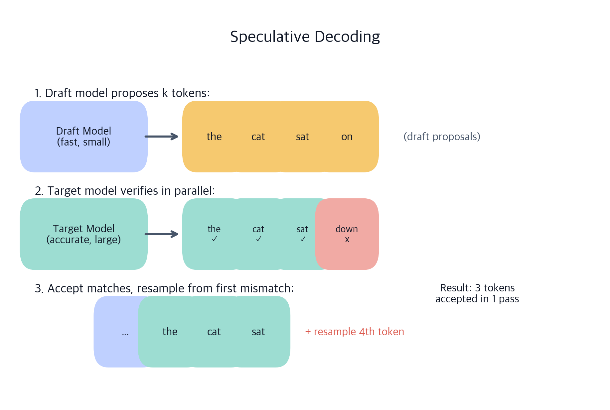
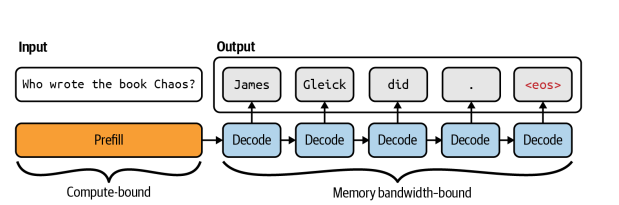
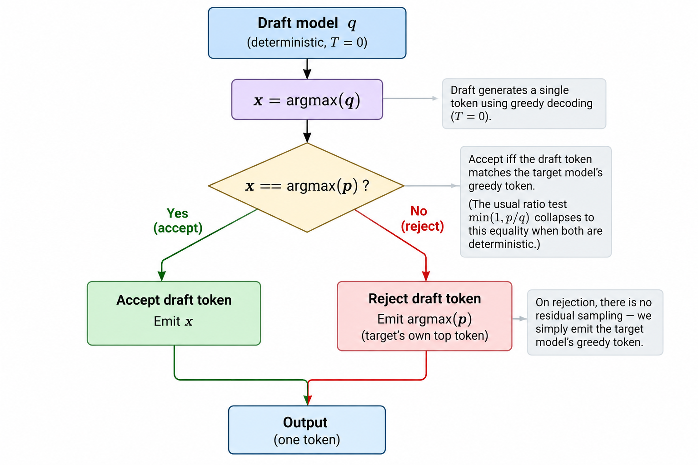
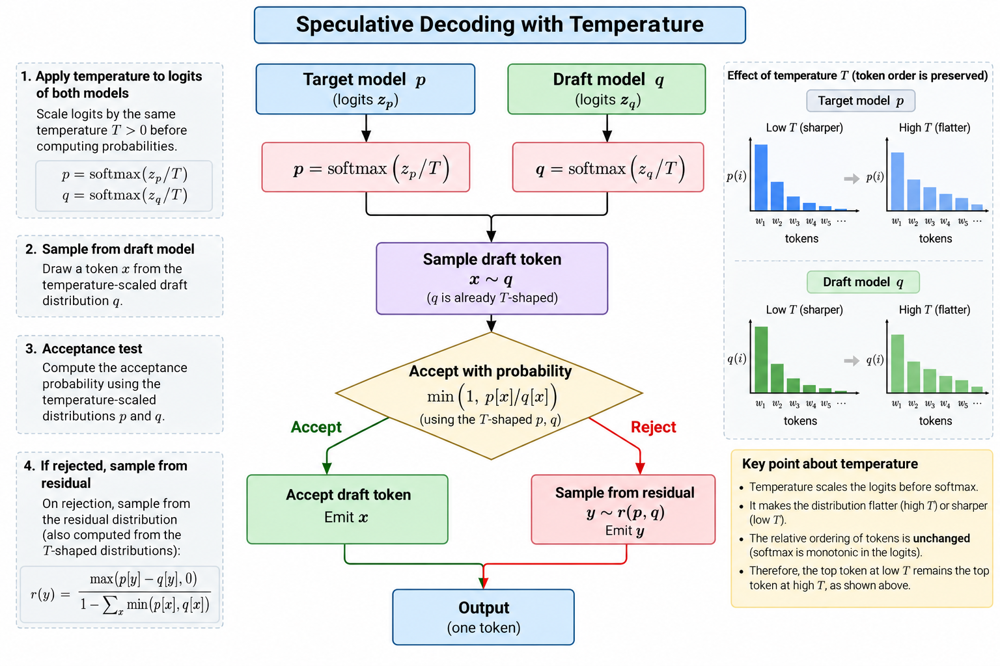
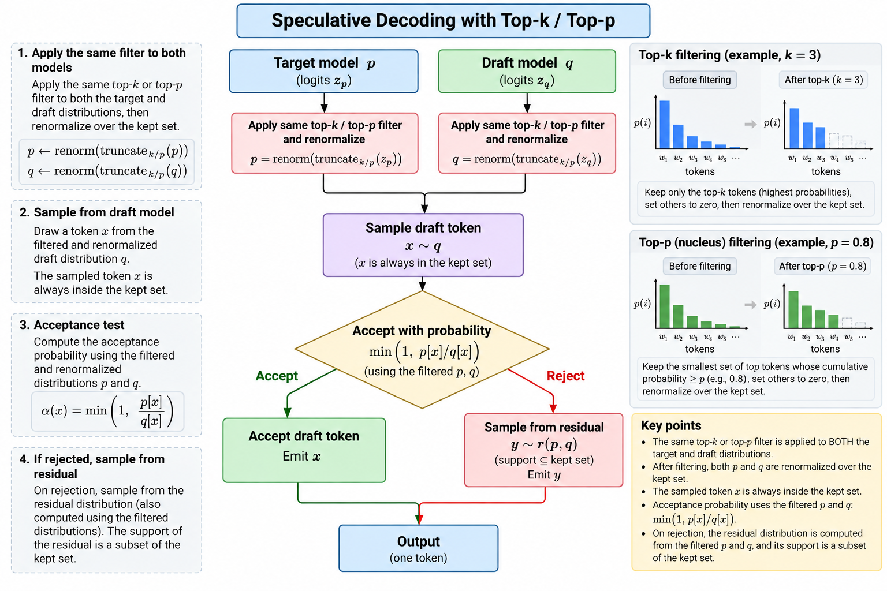
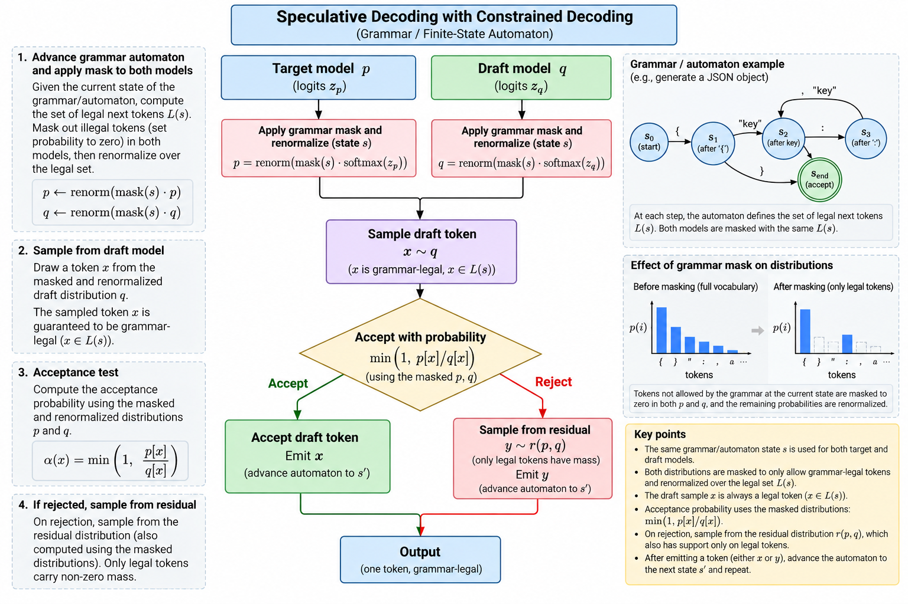

# Speculative decoding

> **Module thesis:** decoding is **serial and memory-bound** — one forward pass over the whole weight set buys exactly one token, and the arithmetic units sit idle while the memory bus runs flat out. Verification is **parallel and compute-bound** — one pass over k+1 positions reads the same weights as a pass over one. Speculative decoding is the trade between them: let something cheap guess ahead, then spend a single target pass checking every guess at once. Same weights, same output distribution, fewer passes.

Lecture 13/14 covered how one distribution becomes one token. These notes are about emitting **several tokens per target pass** without changing what the model says.

**Prerequisites:** [Prefill vs decode and the memory wall](Lecture9_10.md) · [Decoding strategies](Lecture13_14.md)

---

!!! abstract "Part 1 — The big picture"
    The draft model, the loop it runs, why verification is a **prefill**, and the honest boundary of what speculation buys.

## 1. The draft model

Speculation needs a second predictor that is **much cheaper than the target yet agrees with it often**. That is the whole design space.

One constraint is not negotiable: **the drafter must share the target's tokenizer.** The accept test compares `p(x)` and `q(x)` for the same integer `x`; if the two models mean different things by `x`, the comparison is meaningless. A mismatched tokenizer does not raise an error — it shows up as acceptance near zero.

Which predictor to use — n-gram lookup, a trained head, a block drafter — is a design space in its own right, and is [Lecture 17/18](Lecture17_18.md). These notes assume one exists and is loaded.

The two drafters measured throughout these notes, both for `Qwen3.8-27B-FP8`:

- **MTP head**, in-checkpoint, run at `k=4`
- **DFlash2** (`z-lab/Qwen3.8-27B-DFlash2`) — a 3.85 GB block drafter, 5 layers, trained `block_size: 8`, so `k=7`

---

## 2. Draft decodes, target verifies



*Image credit: ChatGPT.*

A walkthrough with `k = 3`, where the target's continuation is *"the cat sat on the mat"*:

| Position | Draft proposed | Target wanted | Outcome |
| --- | --- | --- | --- |
| 1 | `cat` | `cat` | accept |
| 2 | `sat` | `sat` | accept |
| 3 | `down` | `on` | **reject** → emit `on`, discard the rest |

Three tokens (`cat`, `sat`, `on`) out of **one** verification pass. Had all three been accepted, a fourth would come free — the pass already computed the distribution for the position after the last draft. That is the **bonus token**, and it is why a block yields `k+1` rather than `k`.

**A block never yields zero.** Even when the first draft is rejected, the target contributes its own next token — exactly what plain decoding would have produced. So `k` drafts yield between **1 and k+1** tokens.

!!! danger "The bug that deletes the speedup"
    Verification is **one pass over k+1 positions**. Running the target once per draft token produces identical output and passes every correctness test — while doing exactly the work speculation exists to avoid. Whenever you implement or debug this, count target forward passes, not tokens.

---

## 3. Verification is a prefill

This is the section that explains why any of it works.



Single-stream decode is [memory-bound](Lecture9_10.md):

```text
                   memory bandwidth
   tokens/sec  ≈  ──────────────────
                   bytes moved per token
```

Every pass re-reads every weight to produce one token. Arithmetic intensity is near **1 multiply-accumulate per byte fetched**, so a card capable of hundreds of TFLOPs spends decode almost entirely idle, waiting on memory.

Now the pivotal observation:

> **A forward pass that scores 4 positions reads the same weights as a forward pass that scores 1.**

The weight read is the cost. The positions are nearly free. Ordinary decoding throws that capacity away one token at a time; speculation converts it into tokens.

**So verification is structurally a prefill.** It is many positions scored in one pass against one weight read — the left-hand box in the figure, not the right-hand chain. That is the whole economic argument, and it also draws the boundary:

- **Decode has a surplus to sell.** Memory-bound, compute idle.
- **Prefill does not.** Already compute-bound, already scoring many positions.

Which yields a prediction worth stating explicitly: **speculation does nothing for time-to-first-token.** The prefill phase has no idle arithmetic to convert. Speculation shortens the decode phase only.

!!! question "💬 Why does checking 4 drafted tokens cost roughly the same as generating 1?"

    ??? hint "Answer"
        Because the expensive part of a decode pass is **reading the weights out of memory**, and that read is identical whether the pass scores one position or five. At batch 1 the arithmetic units are nearly idle, so the extra positions are absorbed by hardware that was doing nothing. The cost only reappears once k+1 positions grow large enough to saturate the arithmetic units — at which point the pass has become compute-bound and further positions are no longer free.

---

## 4. What it promises

**The output distribution is exactly the target's.** Not approximately, not "close at low temperature". The drafter proposes; the target disposes. Every emitted token is one the target selected, under a rule proven to preserve `p` — see §7.

The engineering consequence is the one worth memorising:

> **A bad drafter costs speed, never accuracy.** If acceptance falls to zero you have wasted compute and produced precisely the output you would have produced anyway.

That asymmetry is why speculation is safe to switch on before measuring anything: the downside is bounded at *slightly slower*, never *subtly wrong*. Contrast with quantisation or distillation, which trade quality for speed by construction.

It also **composes**. Speculation is orthogonal to quantisation, paged attention, prefix caching and the rest of the Lecture 9/10 stack — it spends a different surplus.

---

## 5. What it does not promise

Equal weight to §4. This is where deployments go wrong.

### "Lossless" is a property of the acceptance rule, not of speculation

Relaxed acceptance variants trade the guarantee for speed, and they are easy to enable by accident:

- A threshold rule that accepts any draft token clearing a target probability bar follows the *draft's* preference among valid answers. At temperature 0 this is still exact; at temperature 1 the output distribution shifts and is **no longer lossless**.
- SGLang's `--speculative-accept-threshold-single` defaults to `1.0`, which is exact rejection sampling. Lowering it buys speed by giving up the guarantee.

### It is not a throughput win under load

Speculation and [batching](Lecture9_10.md) are **substitutes** — both fill idle compute per weight read. At batch 1 the surplus is entirely available; by batch 32 real requests have consumed it, and rejected drafts start displacing useful work.

**Speculation is an optimisation for interactive, low-concurrency serving.** A saturated throughput-oriented deployment should usually leave it off.

### It is not free in memory

Draft weights and draft KV slots come out of the same pool as your context window:

| | MTP `k=4` | DFlash2 `k=7` |
| --- | --- | --- |
| Weights | 28.95 GiB | **32.28 GiB** |
| KV pool | 309,329 tokens | **168,340 tokens** |
| Max concurrency at 131k context | 2.36x | **1.28x** |

3.3 GiB of drafter halved concurrency at full context. On long-context agentic workloads this is often the binding constraint, not the speed.

### It is not workload-independent

Acceptance is a property of the **pair and the text**, not the model alone. Two runs of the same short-prompt configuration measured **70.92 and 56.07 tok/s** — 26% apart — with acceptance length moving 3.88 → 3.12, while the non-speculative baseline reproduced to 0.4%. **The variance is in what gets generated**, not in the hardware or the harness.

### It is not automatic

A wrong tokenizer or a drafter that never loaded presents as "no speedup", not as an error. Check the startup log for a resolved drafter architecture.

!!! question "💬 Acceptance is high but throughput did not improve. First thing to check?"

    ??? hint "Answer"
        **Batch size.** At high concurrency, batching has already amortised the weight read across real requests, so there is no idle compute left for speculation to sell — and the drafts you do run compete with useful work. High acceptance with no speedup is the signature of the crossover, not of a bad drafter. Second thing to check: whether the measurement fixed the output length on both arms, since comparing different token counts compares different amounts of work.

---

!!! abstract "Part 2 — Measurement, guarantee, and composition"
    Which numbers predict a speedup, why the output distribution is provably exact, and how the rule specialises per decoding strategy.

## 6. Key measurements

| Metric | Definition | Range | Diagnoses |
| --- | --- | --- | --- |
| **Acceptance rate** | Fraction of drafted tokens kept | 0–1 | *Drafter quality* |
| **Acceptance length** | Mean tokens emitted per verification pass | 1 to k+1 | *Speedup* |

**Acceptance length is the headline.** It already folds in the bonus token and the sequential structure:

```text
speedup  ≈  acceptance length / (1 + overhead)
```

with overhead covering the draft passes and the verification of tokens that get discarded.

### Acceptance is a chain, not an average

The most common modelling error is averaging per-position rates. Position 2 is only evaluated if position 1 was accepted, so the rates **multiply**:

```text
E[tokens per pass]  =  1 + a₁ + a₁a₂ + a₁a₂a₃ + …
                       ↑
                  the token plain decoding would have produced
```

Per-position acceptance for a single-layer draft head at `k=2`, measured on a 27B target:

| Workload | a₁ | a₂ | Chain predicts | Measured |
| --- | --- | --- | --- | --- |
| Code generation | 0.89 | 0.81 | `1 + 0.89 + 0.72` = **2.61** | 2.67–2.70 |
| Prose / reasoning | 0.72 | 0.53 | `1 + 0.72 + 0.38` = **2.10** | 1.98–2.42 |

Both land within measurement noise, so the formula is worth trusting to plan `k` before spending a restart on it.

Note what averaging would do to the code row: mean acceptance is 0.85, and `1 + 2 × 0.85` predicts **2.70** against a chain value of 2.61. The gap is small at `k=2` and compounds fast — every additional position multiplies one more sub-1 factor, so the error grows exactly where you would be deciding whether to raise `k`.

### Choosing k

Payoff decays geometrically while drafting cost grows — linearly for any drafter that drafts autoregressively. The curves cross around `k ≈ 3–4` for such drafters. A **block drafter holds cost flat in `k`** and runs its full trained window instead.

Measured, MTP `k=4` against DFlash2 `k=7`, tok/s:

| Prompt tokens | MTP `k=4` | DFlash2 `k=7` | Delta |
| --- | --- | --- | --- |
| 32 | 53.95 / 53.74 | 70.92 / 56.07 | **+18%** |
| 15,422 | 44.63 / 43.72 | 52.93 / 50.96 | **+17%** |
| 30,922 | 46.57 / 45.44 | 44.38 / 47.81 | ~flat |
| 101,320 | 34.95 / 35.08 | 43.16 / 42.52 | **+22%** |

Each configuration was measured twice and the baseline re-measured afterwards, reproducing within 2% — so the deltas are not thermal drift. **Read the drafter's architecture before trusting any rule of thumb about `k`.**

### The number available before you run anything

The acceptance rate has a closed form in the two distributions:

```text
acceptance rate  =  Σ min(p(x), q(x))  =  1 − TV(p, q)
```

**The trap:** the `k` with the longest acceptance length is not necessarily the `k` with the highest throughput. Sweep and look at both.

<!-- figure: k sweep — acceptance length rising, throughput peaking then falling (two panels, shared k axis) -->

**Lab:** `code/spec_decode/measure.py` sweeps `k` and writes `results/sweep.csv`.

---

## 7. The mathematical guarantee

Conceptually, one drafted position:

```text
                   draft model
                        │
                        ▼
                   sample x ~ q
                        │
                        ▼
             accept with probability
                min(1, p[x] / q[x])
                     /        \
                accept        reject
                   │             │
                   │             ▼
                   │        sample from
                   │      residual(p, q)
                   │             │
                   └──────┬──────┘
                          ▼
                       output
```

Repeat for `i = 1 … k`, stopping at the first reject. If all `k` accept, a **bonus** token is drawn from `pₖ₊₁` — the verification pass already computed it.

The lab's implementation, `code/spec_decode/stage4_sampled_spec.py`, is the same shape:

```python
def accept_reject(p: torch.Tensor, q: torch.Tensor, drafts: list[int]) -> tuple[int, int]:
    """Returns (tokens accepted, the one token that follows them)."""
    for i, x in enumerate(drafts):
        ratio = (p[i, x] / q[i, x]).item() if q[i, x] > 0 else float("inf")
        if torch.rand(()).item() < min(1.0, ratio):
            continue
        return i, int(torch.multinomial(residual(p[i], q[i]), 1))
    return len(drafts), int(torch.multinomial(p[len(drafts)], 1))  # bonus token
```

**Two exits, and both emit a token.** Reject commits a draw from the residual; running the loop out commits the bonus. A block never returns empty — which is why acceptance length is bounded below by 1, not 0.

Three things this rule buys, each worked through on the live pages rather than here:

- **`max(0, p − q)` renormalised** is what makes the emitted distribution exactly `p`. Where the drafter over-proposes a token, acceptance is throttled in proportion; the residual hands back the mass the drafter never supplied.
- **The bonus token** is free — `p_{k+1}` was computed by the same pass.
- **The failure is silent.** An implementation that resamples from `p` instead of the residual has an *identical acceptance rate* and an output distribution that is quietly wrong.

!!! tip "Work through it interactively"
    [**The acceptance rule**](../viz/acceptance-rule.html) — one proposal at a time: q proposes, the ratio test rules, the residual corrects. Watch where the probability mass goes.

    [**Convergence bench**](../viz/rejection-sampling.html) — run it a million times and watch the output settle onto `p`; flip to `--broken` and watch the chi-square catch a bug the acceptance rate cannot see.

!!! note "Lab — implement the mechanics yourself"

    [**Lab 15/16 — Speculative decoding, measured**](../labs/Lab15_16.md) has you implement the three moving parts on dummy data — the **acceptance branch** (`min(1, p/q)`), the **rejection-sampling residual** (`max(0, p − q)`), and a **vectorised verification** over all `k` positions — then a real `gpt2 ← distilgpt2` stitch. Check your emitted distribution settles onto `p`.

Original algorithm: Leviathan et al. ([arXiv:2211.17192](https://arxiv.org/abs/2211.17192)) and, independently, Chen et al. ([arXiv:2302.01318](https://arxiv.org/abs/2302.01318)).

---

## 8. Speculative decoding across decoding strategies

The rule in §7 is the general case. Each strategy from Lecture 13/14 specialises it.

| Strategy | What the accept test becomes | What "lossless" is measured against |
| --- | --- | --- |
| **Greedy** (`T=0`) | `accept while argmax(pᵢ) == xᵢ` | Plain greedy output, **token for token** |
| **Temperature** | `min(1, p/q)` with `T` applied to **both** p and q | The temperature-shaped `p` |
| **Top-k / top-p** | Same test; the same truncation applied to **both** | The truncated-and-renormalised `p` |
| **Constrained (grammar)** | Same test; the same mask applied to **both** | The masked-and-renormalised `p` |

One rule underlies every row: **whatever reshaping the request asks for must be applied to the drafter too, before the ratio is taken.**

### Greedy

`p` collapses to a one-hot vector: probability 1 on the argmax, 0 elsewhere. The ratio test degenerates to an equality check — accept the draft iff it equals the target's argmax, otherwise emit the argmax and stop. No probability theory required, and the output is exactly checkable against plain greedy.

This is why stage 3 of the lab asserts *token-for-token identity* rather than a statistical property. It is the strongest correctness test available, and it is only available at `T=0`.



*Image credit: ChatGPT.*

### Temperature

Scale the logits of **both** models before the softmax. Scaling only `p` leaves `q` proposing for a different distribution — the guarantee still technically holds against the shaped `p`, but acceptance collapses, because you are now comparing two models that disagree by construction.



*Image credit: ChatGPT.*

### Top-k and top-p

Truncation makes this sharper. Suppose the filter is applied to `p` only. If `q` proposes a token outside `p`'s surviving set, then `p(x) = 0`, the ratio is 0, and the token is **always rejected**. Correctness survives — the residual still delivers a valid token from `p`'s set — but the drafter is now spending passes on proposals that cannot possibly be accepted.

The fix is the general rule: apply the same `top_k` / `top_p` to `q` during drafting. Since `q` approximates `p`, the two surviving sets overlap heavily, and the occasional miss is handled by the maths rather than by a wasted block.



*Image credit: ChatGPT.*

### Constrained decoding

The same argument, one step more severe. The grammar mask from Lecture 13/14 zeroes every illegal token in `p`. An unmasked drafter proposes freely, and every illegal proposal has `p(x) = 0` — guaranteed rejection. Acceptance collapses toward zero precisely on the structured workloads where speculation would otherwise shine, because the drafter spends its passes proposing tokens the automaton already forbade. Engines therefore advance the same automaton over the drafter.



*Image credit: ChatGPT.*

!!! question "💬 Temperature is applied to the target but not the drafter. What breaks?"

    ??? hint "Answer"
        **Not correctness — acceptance.** The test `min(1, p/q)` is valid for *any* `q`, so the emitted distribution is still exactly the temperature-shaped `p`. But `q` is now proposing from an unshaped distribution while `p` has been sharpened or flattened, so the two disagree far more often than the models themselves do. The rejection rate climbs, acceptance length falls toward 1, and you pay the drafter's passes for nothing. This is the general shape of every mistake in this section: **mismatched reshaping is a throughput bug, not a correctness bug** — which is exactly what makes it hard to notice.

---

## 9. In practice

vLLM takes the drafter as one config block:

```bash
--speculative-config '{"method":"dflash","model":"z-lab/Qwen3.8-27B-DFlash2","num_speculative_tokens":7}'
```

Startup confirms the drafter actually resolved — the check that catches the silent-failure mode in §5:

```text
Resolved architecture: DFlash2DraftModel
Capturing model for DFlash2 speculator...
```

### A deployment checklist

1. **Confirm the precondition** — is decode actually bandwidth-bound at batch 1? If not, there is no surplus to sell.
2. **Baseline first**, with fixed output length on both arms. Different token counts are different amounts of work.
3. **Verify the drafter loaded.** A silently inert drafter looks like "no speedup", not like an error.
4. **Read acceptance, not just throughput.** Acceptance length near 1.0 is pure overhead — turn it off.
5. **Measure the memory cost** — KV pool capacity with speculation on and off.
6. **Re-measure at your real concurrency**, not just batch 1.

### Failure modes

| Symptom | Cause |
| --- | --- |
| No speedup, acceptance ~0 | Drafter never loaded, or tokenizer mismatch |
| No speedup, acceptance high | Concurrency too high; batching already took the surplus |
| Speedup at batch 1, slower under load | The crossover — taper `k` with batch size, or disable |
| Startup OOM after enabling | Draft weights plus draft KV slots exceeded the budget |
| Context window shrank | The memory tax; lower `k` or accept the trade |
| Position 2+ acceptance far below position 1 | One draft layer reused for extra positions; lower `k` |

Startup time is worth budgeting for: 142–217 s with a block drafter against 66–148 s without, the difference being drafter load plus `torch.compile` of its head and selector.

---

## References

1. Leviathan et al., [*Fast Inference from Transformers via Speculative Decoding*](https://arxiv.org/abs/2211.17192) (ICML 2023) — the accept/reject rule and the residual
2. Chen et al., [*Accelerating Large Language Model Decoding with Speculative Sampling*](https://arxiv.org/abs/2302.01318) (2023) — the independent derivation
3. Cai et al., [*Medusa*](https://arxiv.org/abs/2401.10774) (2024) — multiple heads; the threshold rule that gives up losslessness above `T=0`
4. [Lecture 9/10](Lecture9_10.md) — prefill vs decode, the memory wall this technique exploits
5. [Lecture 13/14](Lecture13_14.md) — the decoding strategies §8 composes with
