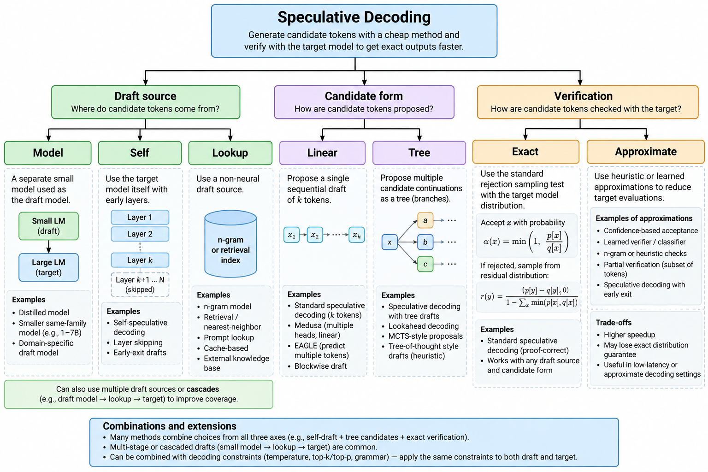
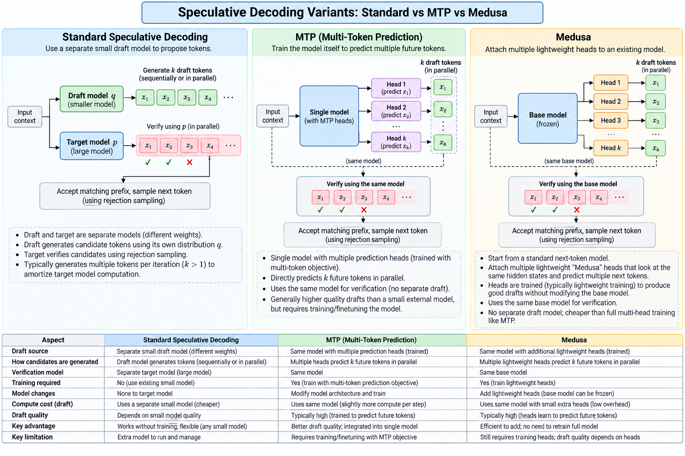

# Variations of speculative decoding

> **Module thesis:** [Lecture 15/16](Lecture15_16.md) showed the loop is correct for **any** drafter — a bad one costs speed, never accuracy. That freedom produced a large family of variants. They look unrelated until you notice they are choices on **three independent axes**: where the draft comes from, what shape the candidates take, and how verification is done. Pick one option per axis and you have named a system.

**Prerequisite:** [Speculative decoding](Lecture15_16.md)

---

## 1. The map



*Image credit: ChatGPT.*

**The axes are independent.** An n-gram drafter with tree candidates and exact verification is a valid system; so is a Medusa head with linear candidates and threshold acceptance.

**A fourth knob sits on top of all three:** *how much* to speculate — the draft length `γ`. It is not a branch of the tree because it applies to every combination.

---

## 2. Axis 1 — where the draft comes from

### Separate draft model

The canonical setup, and the one Lecture 15/16 described.

```
Draft model q  ──► x₁ x₂ … xγ  ──►  Target p verifies all γ in one pass
```

**Needs:** a second checkpoint, 1–2 GB VRAM, an exactly matching tokenizer.  
**Costs:** re-derives context from scratch — it has no access to the target's internal state.

### Self-speculation

The target drafts for itself by running cheaply.

```
Target model
 ├── shallow execution (layers 1…12)   → draft
 └── full execution    (layers 1…64)   → verify
```

Variants: early exit, skipped layers, a subset of layers, shared KV.

**Wins:** no second model, no extra weights, draft and target share parameters.  
**Loses:** a truncated model is a *different* model, so acceptance is mediocre.

### Lookup: prompt and n-gram

No neural drafter at all. Predict from text already present.

```
context:  for i in range(...):
              ...
lookup →      print(...)
```

- **Prompt lookup** — match the last few tokens against earlier context, copy what followed.
- **N-gram** — a table built from observed text: `"import numpy as" → "np"`.

**Cost is negligible.** Acceptance depends entirely on repetition in the workload — strong on code and structured output, near zero on novel prose.

### Heads attached to the target

Small trained modules reading the target's hidden state `hₜ`.

```
                 ┌─ head 1 → t+1
  Transformer ───┼─ head 2 → t+2
                 ├─ head 3 → t+3
                 └─ head 4 → t+4
```



*Image credit: ChatGPT.*

Both attach extra prediction heads. That shared surface is why they get confused, and **the head count is not the distinction.**

| | MTP | Medusa |
| --- | --- | --- |
| **Core idea** | Future-token prediction as a **training objective** | Extra decoding heads **bolted onto a finished model** |
| **When acquired** | During pre-training, with the base model | After the fact; base typically frozen |
| **Purpose** | Teach the model to see further ahead | Turn an existing model into a speculative decoder |
| **Separate draft model?** | No | No |
| **Works with tree verification?** | Yes | Yes |

**They are not competitors.** Both are mechanisms for producing future-token predictions; those predictions then feed the same draft→verify loop. A modern system can use MTP-trained components inside a Medusa-style arrangement.

#### How the heads are trained

The training data already contains the targets — no extra labelling is needed.

```
sequence:  … A  B  C  D  E  F  G …
                    ↑
                    t

   original LM head  →  D     (t+1)
   extra head 1      →  E     (t+2)
   extra head 2      →  F     (t+3)
   extra head 3      →  G     (t+4)
```

**Head `k` is trained against the token `k` positions ahead**, with a cross-entropy loss per head, weighted:

```
L = L_head1(D) + λ₂·L_head2(E) + λ₃·L_head3(F) + λ₄·L_head4(G)
```

The base model is usually **frozen**. Only the heads train, which is why this is cheap to add to a checkpoint someone else shipped.

#### The conditioning gap

Here is the structural weakness, and it explains a number you have already seen.

```
ordinary autoregressive:   hₜ → t+1 → t+2 → t+3     each step sees the last
extra head 3:              hₜ ──────────────→ t+4    never sees t+2 or t+3
```

Head 3 must learn `P(x₊₄ | hₜ)` rather than `P(x₊₄ | x≤₊₃)`. It is predicting four positions out from a representation that knows nothing about the three tokens in between.

**Three consequences:**

- These heads are **not equivalent to running the model k times.** They are cheaper precisely because they skip the conditioning.
- **Acceptance decays with position** — this is the mechanism behind Lecture 15/16's *"position 2+ acceptance far below position 1"*.
- **Verification absorbs the whole cost.** The weakness shows up as speed, never as quality, which is the freedom the thesis opened with.

A related decay affects single-layer heads reused across positions: they *do* condition, but on their own unverified output, so error compounds instead of being absent.

#### Why trees fit heads naturally

Each head emits a full distribution, not one token. Taking only the argmax throws that away.

```
head 1 → D  (also: D' D'')
head 2 → E  (also: E')
head 3 → F
```

Keep the top few per position and the linear draft becomes a tree at no extra drafting cost — the forward pass already computed them. This is why Medusa and EAGLE ship tree verification and simple MTP setups often do not.

### EAGLE: predict features, not tokens

```
target hidden state
        ↓
small feature predictor
        ↓
future hidden states
        ↓
target's own LM head
        ↓
candidate tokens
```

Predicting the *next hidden state* rather than the next token id keeps far more information in play, and the target's own LM head does the final conversion. **This produces substantially stronger drafts than token-level heads of similar size.**

### Block drafters

Propose the **whole window in one pass** instead of one token at a time, keeping candidates at every position and running a selector to trace a path.

| | Autoregressive drafter | Block drafter |
| --- | --- | --- |
| Passes to draft `γ` | `γ` sequential | **1** |
| Cost in `γ` | linear | **flat** |
| Optimal `γ` | early, 3–4 | its trained block size |

Because cost is flat, "stop at γ≈3–4" does not apply — that rule describes autoregressive drafters only.

**Anatomy of one** — `z-lab/Qwen3.8-27B-DFlash2`, drafting for `Qwen3.8-27B`:

| Field | Value |
| --- | --- |
| Size | 3.85 GB, bf16 |
| Layers | 5, sliding attention, window 2048 |
| `block_size` | **8** → `num_speculative_tokens: 7` |
| Selector | rank 256, top-k 16 |
| Target taps | layers `[5, 19, 33, 47, 61]` of 64 |
| `is_causal` | **False** |

Two fields carry the design. **`is_causal: False`** is what lets it fill a block rather than extend a sequence. **The target taps** read the target's hidden state at five depths — the head trick, applied to a whole block.

**It must run its trained window.** Shorter windows measure *slower*: the model was fitted to produce 8 positions and produces them whether you ask for 8 or 3.

### Cascades

Several drafters in a chain, each filtering for the next.

```
tiny model  →  small model  →  medium model  →  large target
   1B             7B              35B            verify
```

The cheap model proposes, intermediates filter, and the expensive model only verifies survivors. Mostly interesting on heterogeneous hardware.

---

## 3. Axis 2 — what shape the candidates take

### Linear

One candidate sequence. Everything in Lecture 15/16 assumed this.

### Tree

Several alternatives per position, verified together behind an attention mask that stops branches seeing each other.

```
        A
      / | \
     B  C  D
    / \    |
   E   F   G
```

**Raises acceptance** — the target need only agree with *some* branch rather than one specific guess.  
**Costs positions** — more positions per verification pass, which eventually reintroduces the compute pressure speculation was exploiting.

Tree verification is where head-based drafters shine: each head already produces a ranked list, so keeping the top few candidates per position is free.

### Parallel / Jacobi

A different mechanism entirely. Rather than extending left to right, guess all positions at once and iterate to a fixed point.

```
????  ????  ????  ????
  A     B     C     D
  A     E     F     G
  A     E     H     I
```

Each round refines; the prefix stabilises first. Related to blockwise parallel decoding. Classified here because the draft/verify framing still applies, though the mechanics differ substantially.

---

## 4. Axis 3 — how verification is done

### Exact

The rejection-sampling rule from [Lecture 15/16 §7](Lecture15_16.md) — accept with probability `min(1, p/q)`, and on rejection draw from the residual. The emitted distribution is exactly `p`.

This is the correctness core the lab's stage 0 implements.

### Approximate

Deliberately relax exactness for throughput: confidence thresholds, greedy verification schemes, accepting any draft token clearing a probability bar.

**The trade is real and usually undisclosed.** At temperature 0 these schemes are often still exact, because greedy has one right answer. Above temperature 0 the output distribution shifts toward the *draft's* preferences.

**Check the default before assuming lossless.** Lecture 15/16 §5 records an engine flag that ships at the exact setting and silently gives up the guarantee when lowered.

---

## 5. The knob on top — how much to speculate

`γ` applies to every combination of the three axes.

| Strategy | How `γ` is chosen |
| --- | --- |
| **Fixed** | One constant, e.g. `γ = 5`. What most tutorials show |
| **Adaptive** | Per step, from a signal: draft confidence, entropy, recent acceptance, target/draft disagreement |
| **Learned** | A controller decides how much — or whether — to speculate at all |

Adaptive schemes exist because **the optimal `γ` is not constant**. Confidence varies within a single generation: boilerplate tolerates a long window, a genuine branch point does not.

A learned controller optimises the right objective:

```
        tokens generated
   ─────────────────────────
   target-model computation
```

Note that this is **not** acceptance rate. Lecture 15/16 §6 showed the two diverge — the `γ` with the longest acceptance length is not the `γ` with the highest throughput.

---

## 6. Choosing

```
block drafter published for this model?   -> usually fastest, if VRAM allows
checkpoint ships an MTP head?             -> the zero-acquisition default
output largely copies the input?          -> n-gram / prompt lookup
trained EAGLE head available?             -> strongest drafts for its size
VRAM plentiful and a sibling exists?      -> small draft model
else                                      -> skip speculation
```

Read top to bottom, stop at the first yes. The order is **acquisition cost against expected acceptance**, not sophistication — lookup sits third because when it applies it beats trained drafters costing gigabytes.

!!! question "💬 Your checkpoint ships an MTP head and a block drafter exists for it. You serve 128k-token agentic sessions on a single card. Which do you choose?"

    ??? hint "Answer"
        Probably the **MTP head**, despite the block drafter being faster in tokens/sec. The block drafter's weights come out of the KV pool, and at long context that is the binding constraint — Lecture 15/16 records 3.3 GiB of drafter cutting the KV pool from 309,329 to 168,340 tokens and halving concurrency at full context. A 22% decode gain is a poor trade for halving how many long sessions fit. **The answer inverts at short context**, where KV pressure is slack and the throughput win is free. This is why the decision list ends at "if VRAM allows" rather than at "fastest".

---

## 7. What to measure before choosing

Acceptance is a property of the **pair and the workload**, so a published number predicts little about your traffic.

1. **Baseline with speculation off**, fixed output length.
2. **Try lookup first** — it costs nothing to evaluate and sets the bar everything else must beat.
3. **Read acceptance length, not throughput** — near 1.0 means pure overhead.
4. **Measure the KV pool** with the drafter loaded and without.
5. **Re-measure at real concurrency** — batch 1 flatters speculation.
6. **Sweep `γ`**, knowing which cost model your drafter obeys: linear or flat.

**Lab:** `code/spec_decode/` implements the separate-model and lookup families behind one interface, so the two can be swapped and swept against the same target.

---

## References

1. Cai et al., [*Medusa*](https://arxiv.org/abs/2401.10774) (2024) — extra decoding heads, tree attention
2. Li et al., [*EAGLE*](https://arxiv.org/abs/2401.15077) (2024) — feature-level drafting
3. [Lecture 15/16](Lecture15_16.md) — the mechanism, the guarantee, the measurements
4. [Lecture 9/10](Lecture9_10.md) — the memory wall these variants are spending
