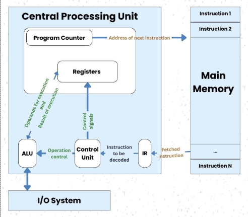
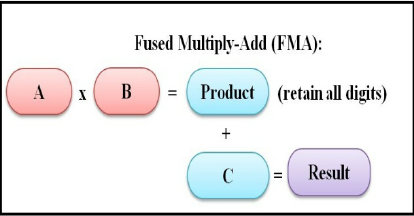

# Why Accelerators Exist


## The CPU baseline

### The machine you already know
  

- The von Neumann loop: **fetch → decode → execute** (→ memory access → write back)
    - Fetch the next instruction from memory, decode what it asks for, execute it, repeat — billions of times per second
- One core = one instruction stream, executed *in program order* (as far as you can tell)
- The contract a CPU offers: run *any* program — branchy, pointer-chasing, unpredictable — as fast as possible

### Where the transistors actually go

A modern CPU core is mostly *not* arithmetic. The ALU is a sliver; the rest is machinery for keeping that one instruction stream moving:

- **Branch prediction** — guess which way an `if` goes before it resolves; speculate past it (~95%+ accuracy)
- **Out-of-order execution** — hundreds of instructions in flight, reordered around stalls, retired in order
- **Deep cache hierarchy** — L1 → L2 → L3, most of the chip's area, betting that data just used will be used again
- **Prefetching, register renaming, speculation** — all in service of *latency*: finish this one stream sooner


The unifying idea: arithmetic takes ~1 cycle, but a trip to DRAM takes ~300. A core is a machine for **hiding latency in a single instruction stream** — every feature below is a different trick for the same goal.

#### Branch prediction

- *Intuition*: reading a choose-your-own-adventure aloud, but the page saying which fork to take arrives late. Don't wait — notice the story went left 47 of the last 50 times, guess left, keep reading. Wrong guess → tear up the notes, go back.
- The pipeline fetches instructions many cycles before an `if` resolves; the predictor keeps history tables ("what did this branch do recently, given the path that led here?"). Loops and structured code predict at 98–99%+
- A wrong guess **flushes** everything fetched after the branch: ~15–20 cycles lost
- Cost model: extra cycles/instruction = (branch fraction) × (miss rate) × (flush penalty). E.g. 0.20 × 0.05 × 15 ≈ **0.15 cycles per instruction** — a huge tax on a core aiming for 4 instructions/cycle
- Why accuracy must be *extreme*, not just good: speculating past 20 branches at 95% each → 0.95²⁰ ≈ 36% chance all were right; at 99% → 82%


#### Out-of-order execution & register renaming

- *Intuition*: a cook who hits "wait for the dough to rise" doesn't stop — they look ahead and chop the onions now, as long as the dish comes together *as if* the recipe order was followed
- Instructions enter a **reorder buffer** (~300–600 entries) in program order; any instruction whose inputs are ready executes, regardless of position; results **retire in order**, so the illusion of sequential execution holds — which is also what makes speculation safe to undo
- **Register renaming** removes *false* dependencies: 16 architectural names (`rax`, …) are aliases onto ~300 physical registers, so two writes to "`rax`" become independent values, not a collision
- Why the window is so big: to hide an *L*-cycle miss on a *W*-wide core you need ~*W × L* independent instructions in flight — 4 × 300 ≈ 1200, more than even today's windows. A DRAM miss still hurts


#### Cache hierarchy

- *Intuition*: desk (L1) → drawer (L2) → filing cabinet (L3) → warehouse (DRAM). Whatever you just used stays on the desk, because you'll likely need it again in a moment
- The hierarchy is a *bet* on two empirical properties of real programs:
    - **Temporal locality** — data touched now will be touched again soon (loop variables, hot structures)
    - **Spatial locality** — data *near* it will be touched too; caches move 64-byte lines, not bytes, precisely for this
- The bet pays off so often that over half the die is SRAM

  

#### Prefetching

- *Intuition*: the librarian who sees you request volumes 3, 4, 5 — and fetches 6 and 7 before you ask
- Hardware watches the address stream; a constant stride (array traversal) is detected within a few accesses and loads are issued several steps *ahead* — the miss isn't faster, it's **started earlier**, overlapped with useful work
- This is why linear array scans run near full speed while pointer-chasing (linked lists, trees) crawls: no pattern → every hop eats the full latency, serialized

!!! question "💬 Quick check"
    Roughly what fraction of a modern CPU core's silicon does actual arithmetic?

    ??? hint "Answer"
        - A few percent. The overwhelming majority is control, prediction, and cache — overhead for keeping one stream fed.
        - Corollary: for a workload that doesn't need the machinery, almost the whole transistor budget is wasted.

### The memory wall

- The numbers that define computing:
    - Arithmetic: a fused multiply-add costs **~1 cycle**  
    - L1 cache hit: ~4 cycles 
    - L2: ~12 
    - L3: ~40  
    - **Main memory (DRAM): ~200–400 cycles**  
- One cache miss = hundreds of potential arithmetic operations forfeited
- How well does the hierarchy paper over this? **Average memory access time** nests across levels:  
    - `AMAT = t_L1 + m_L1 · (t_L2 + m_L2 · (t_L3 + m_L3 · t_DRAM))`
    - With hit rates 95% / 80% / 60%: `4 + 0.05·(12 + 0.20·(40 + 0.40·300)) ≈` **6 cycles** — vs 300 with no caches, a ~50× win from betting on locality
- The gap has *widened* for 30 years: compute (FLOPs) has scaled far faster than memory bandwidth
    - Transistors got smaller and faster; wires to off-chip DRAM did not keep pace
- Consequence: **moving bytes, not multiplying them, is the bottleneck**
    - Caches, prediction, out-of-order — the whole CPU design — are all *responses to the memory wall* for irregular programs
    - Keep this fact in view all module: the GPU will need a *different* answer to the same wall

## The workload: what does ML actually ask for?

### It's matmul all the way down

- Nearly everything in a neural network *is* (or reduces to) a **matrix multiplication**:
    - Linear / fully-connected layers — literally `X @ W`
    - Attention — Q·Kᵀ and scores·V are both matmuls
    - Convolutions — unrolled (im2col) into matmuls
- Training and inference alike: the same matmuls, run millions of times
- Everything that *isn't* matmul (softmax, LayerNorm, activations) is tiny by FLOP count — it will matter later, but for a different reason

### Anatomy of one matmul

  
```
C[i,j] = Σₖ A[i,k] · B[k,j]
```

- Each output element `C[i,j]` = one **dot product** = a chain of **fused multiply-adds** (FMA: `acc += a·b`, ~1 cycle)
- Count the work: multiplying two 4096×4096 matrices = 4096³ ≈ **69 billion FMAs** — for *one* layer of *one* forward pass

### The three properties that change everything

1. **Independent** — `C[i,j]` never needs any other output element; all ~17 million outputs could be computed *simultaneously*
2. **Identical** — every output runs the *same* instruction sequence, only on different data
3. **Regular** — memory access follows a predictable pattern known *before the program runs*; nothing to predict, nothing to speculate

### Now look back at the CPU

- Branch prediction? **There are no branches.**
- Out-of-order machinery? **There is no dependency chain to reorder around.**
- Deep speculative pipeline? **The access pattern is known in advance.**
- Almost every transistor the CPU spent on making one stream fast is *useless overhead* for this workload

!!! question "💬 Design exercise"
    You get the same transistor budget as a CPU. The workload is billions of independent, identical, regular FMAs — nothing else. What hardware would *you* build?

    ??? hint "Answer"
        - Rip out prediction, reordering, speculation — spend nearly everything on **arithmetic units**
        - Every operation is identical → one instruction decoder can drive *many* ALUs in lockstep
        - Independence → no need for any single unit to be fast; you win on **width**
        - This is, roughly, a GPU. But before meeting it, next lecture we build each of its tricks **by hand, on a CPU** — and measure what every one is worth.

## References

1. Vijay Janapa Reddi, [*Machine Learning Systems*](https://mlsysbook.ai) — Ch 11: AI Acceleration (§§ 11.2–11.4)
