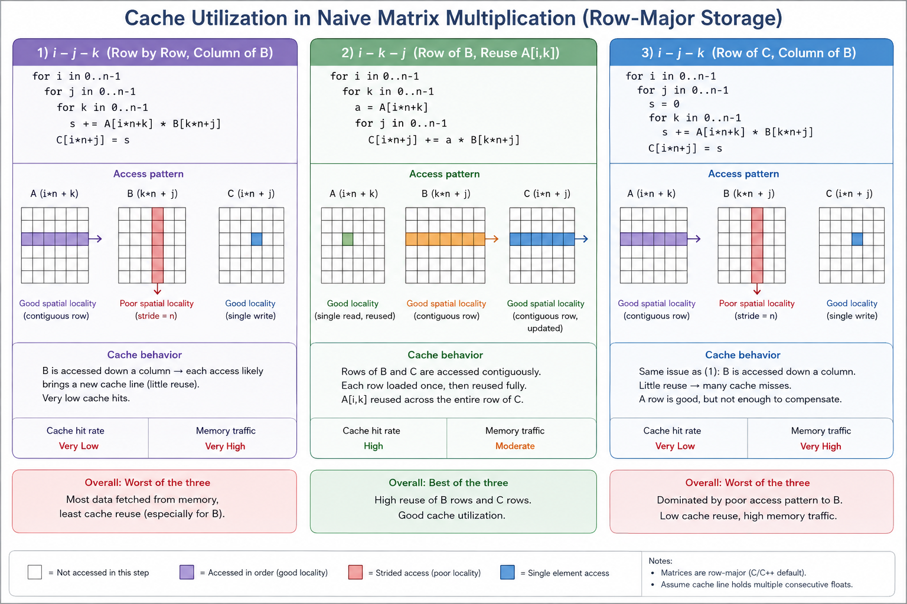

# The Memory Hierarchy and the Roofline

> **Module thesis:** modern ML performance is a bandwidth problem wearing a compute problem's clothes.

## Demo: The Matmul Ladder

One fixed problem — an N×N FP32 matrix multiplication — solved nine ways, from naive Python to GPU tensor pipes. Only one number changes from rung to rung:

```
GFLOP/s = 2N³ / time
```

(2N³ because each of the N² output elements is a dot product of N multiply-adds, and an FMA counts as 2 FLOPs.)

Every rung isolates **one hardware fact**. By the top of the ladder you'll see that every CPU optimization we write by hand is a software imitation of something the GPU does natively.

**Code:** [`code/ai_acceleration/`](https://github.com/Ankush-Chander/DS635-ml-system-engineering/tree/main/code/ai_acceleration) — every rung prints the same line (`name, N, seconds, GFLOP/s, check`), and every rung is verified against the same NumPy-computed reference. If an "optimization" breaks the math, the harness says FAIL. Numbers below are from one specific laptop (8-core Zen 3, RX 6700M); yours will differ — **the shape of the curve is the lesson, not the numbers.**

---

### Naive Python

*Code: `rung0_python_naive.py`*

```python
for i in range(N):
    for j in range(N):
        s = 0.0
        for k in range(N):
            s += A[i][k] * B[k][j]
        C[i][j] = s
```

- **Concept: interpreter overhead.** Every `+` and `*` here is a dispatch through the Python object system — type checks, boxing, reference counting — costing hundreds of instructions per floating-point operation.
- Result: **0.05 GFLOP/s**, run at N=256 because at N=1024 it takes closer to a minute. This is the zero of our scale.

### NumPy

*Code: `rung1_numpy.py`*

```python
C = A @ B
```

!!! question "💬 One line of Python. ~5000× faster than the naive Python version. How?"

    ??? hint "Answer"
        - `@` dispatches to a **BLAS** library (OpenBLAS here) — decades of hand-tuned, blocked, vectorized, multithreaded native code.
        - **249 GFLOP/s.** Everything we're about to build by hand, someone already built — that's what "calling a library" actually means.

#### Inside one call to `A @ B`

#### Call an Optimized Library (BLAS)

* `A @ B` invokes `A.__matmul__(B)` in Python.
* NumPy validates the inputs (shape, dtype) and **dispatches** the entire operation to a compiled routine (`sgemm`).
* After dispatch, the Python interpreter is no longer involved.
* **Key idea:** interpreter overhead is paid **once per matrix multiplication**, instead of once per arithmetic operation.

> **Dispatch:** handing a high-level operation to an optimized native implementation.

---

#### BLAS: A Standard Interface

**BLAS (Basic Linear Algebra Subprograms, 1979)** defines a standard API for linear algebra routines.

| Level   | Operation     | Example                   |
| ------- | ------------- | ------------------------- |
| Level 1 | Vector–Vector | Dot product               |
| Level 2 | Matrix–Vector | `Ax`                      |
| Level 3 | Matrix–Matrix | `gemm` (`sgemm`, `dgemm`) |

* BLAS specifies the **interface**, not the implementation.
* Any software using BLAS (NumPy, PyTorch, MATLAB, R, Fortran, etc.) automatically benefits from faster implementations.

**Common implementations**

* CPU: OpenBLAS, BLIS, Intel MKL
* GPU: cuBLAS (NVIDIA), rocBLAS (AMD)

---

#### OpenBLAS

On this machine, NumPy uses **OpenBLAS**.

* Detects the CPU at runtime.
* Selects kernels optimized for the detected microarchitecture.
* Core computation is performed by a highly tuned **micro-kernel** (typically operating on small blocks such as **8×8**) that keeps registers and FMA units busy.

---

#### Why Is BLAS So Fast?

A modern BLAS implementation combines multiple optimization techniques:

* Native compiled machine code (no interpreter overhead)
* Cache-friendly memory access
* Cache blocking (tiling)
* SIMD vector instructions (8–16 values per instruction)
* Multi-core parallel execution

**Key takeaway:** High performance comes from combining many well-known optimizations—not a single breakthrough. The remaining rungs of the performance ladder isolate and explain each of these techniques individually.


### Naive C

*Code: `rung2_c_naive.c`*

Same triple loop, compiled with vectorization disabled so we isolate one idea at a time.

**Performance Intuition**

Suppose multiplying two numbers takes roughly 1 CPU cycle.  
A Python iteration may require hundreds of instructions before reaching that multiplication.
```
Python:
Interpret → Type Check → Lookup → Multiply → Add → Store

C:
Load → Multiply → Add → Store
```

Thus, even with the same O(N³) algorithm, C typically achieves 20–100× higher performance than naïve Python for compute-intensive loops.

### Cache Utilization

#### Warm-up — the cache, in one array

Before touching matmul again, a simpler experiment. Sum all elements of one large N×N array, two ways:

```c
for (i) for (j) sum += A[i][j];   // walk along rows
for (j) for (i) sum += A[i][j];   // walk down columns
```

Same elements, same additions, same Big-O — yet the first is several times faster. With everything else identical, only one explanation is left: **the order in which memory is touched**.

Why: DRAM doesn't hand the CPU one float — it hands over a **cache line** of 64 bytes (16 floats) at a time. The row walk uses all 16 before asking for the next line; the column walk uses 1 of the 16, and by the time that column comes around again, the line is long evicted.

The principle — and note it is *not* "rows good, columns bad":

> **Access memory in the order it is stored.** C stores arrays row-major; Fortran and MATLAB store column-major, and there the *opposite* loop wins. The lesson is locality, not rows.

#### Loop reorder (i-k-j)

*Code: `rung3_c_reorder.c`*

Now apply the warm-up to the naive C inner loop, `s += A[i*n+k] * B[k*n+j]`:

!!! question "💬 As `k` counts up, which operand walks along a row, and which walks down a column?"

    ??? hint "Answer"
        - `A[i*n+k]` — walks a **row** ✔
        - `B[k*n+j]` — walks a **column** ✘: jumps n floats per step, one wasted cache line per access. The warm-up's slow case, hiding inside matmul.

Reordering the loops to i-k-j fixes it — the inner loop (now over `j`) walks *both* `B` and `C` along rows:

```c
for (int i = 0; i < n; i++)
  for (int k = 0; k < n; k++) {
    float a = A[i*n+k];
    for (int j = 0; j < n; j++)
      C[i*n+j] += a * B[k*n+j];
  }
```



- Result: **~9× faster** (0.37 → 3.48 GFLOP/s) — same arithmetic, same instruction count, same flags.
- The cache agrees, measurably: `cachegrind` reports a **49.9% L1 miss rate for i-j-k vs 2.1% for i-k-j** — one miss per element vs one miss per 16-float cache line.
- Matmul adds one thing the warm-up couldn't show: `a = A[i*n+k]` is loaded **once** and reused across a whole row of `C` — **temporal locality** (reuse before eviction) on top of spatial. Tiling, later in the ladder, takes temporal locality further.
- **Concept: memory access order.** Nothing about the computation changed — only the order in which memory is touched. Say it once and remember it all term: *this was never a compute problem; it's a memory problem.*
- The GPU version of this exact fact is called **memory coalescing** — we'll meet it soon.

??? example "🔬 Verify it yourself — watch the cache misses directly"

    Don't take the explanation on faith; the CPU has hardware counters that count cache misses, and `perf` reads them.

    **Cache simulation (`cachegrind`), no sudo needed.** Valgrind simulates the cache instead of reading counters (~50× slower, hence single rep):

    ```bash
    cd code/ai_acceleration
    for b in rung2_c_naive rung3_c_reorder; do echo "== $b =="; valgrind --tool=cachegrind --cache-sim=yes ./build/$b 1024 1 2>&1 | grep -E "D  refs|D1  miss|LLd miss"; done
    ```

    **Reading the output.** Cachegrind simulates a first-level data cache (`D1`, your L1d) and a last-level cache (`LL`, your L3) — the simulated sizes are printed in the run's header lines. Each access is checked top-down: miss L1 → go to L3; miss L3 → go to DRAM.

    | Output line | Meaning |
    |---|---|
    | `==NNNNN==` | Just the process ID valgrind prefixes to its output |
    | `D refs` | Total data accesses, split `rd` (reads) + `wr` (writes) |
    | `D1 misses` | Accesses that missed L1 and had to reach L3 |
    | `LLd misses` | Data accesses that missed L3 too — the DRAM trips (`d` = the data share; instruction fetches are `LLi`) |
    | `D1 / LLd miss rate` | The misses above ÷ `D refs`, per category |

    Two decodings worth showing off: the naive run's **50.0% read miss rate** is literal — the inner loop makes exactly two reads per iteration, `A[i*n+k]` (row walk, hits) and `B[k*n+j]` (column walk, misses): one of two = 50%. And `LLd misses` ≈ 198k reads ≈ the three matrices' 12 MB ÷ 64-byte lines — pure *cold misses*, each line's unavoidable first touch, after which everything lives in L3.

    What to expect (cachegrind, N=1024):

    | | i-j-k (naive) | i-k-j (reordered) |
    |---|---|---|
    | L1-d misses | ~1.08 billion | ~67 million |
    | L1-d miss rate | ~50% | ~2% |
    | Last-level misses | ~264k | ~264k |

    Three checks worth doing against theory:

    1. N³ = 1,073,741,824 — the naive version misses almost **once per `B` access**.
    2. 67M ≈ N³/16 — the reordered version misses **once per 16-float cache line**, exactly as the warm-up predicted.
    3. Last-level misses are **identical** — both versions move the same data through DRAM at this size. The entire 9× win is L1 locality, a fact the GFLOP/s number alone could never tell you.

    (Caution: cachegrind's own timing is meaningless — simulation overhead flattens the difference. Use the harness for *time*, cachegrind for *why*.)

### SIMD

*Code: `rung4_c_simd.c` — same source as the loop-reorder step; the change is compiler flags (`-O3 -march=native -ffast-math`)*

The flags don't change the algorithm — they change how aggressively the compiler is allowed to translate it into machine instructions:

| Flag | What it allows | Trade-off | Impact here |
|---|---|---|---|
| `-O3` | Every generally-safe optimization: inlining, dead-code removal, **auto-vectorization** | Longer compiles | ★★★★★ |
| `-march=native` | Instructions specific to *this* CPU: AVX2 vectors, FMA (`a*b+c` in one instruction) instead of generic x86-64 | Binary may not run on older CPUs | ★★★★ |
| `-ffast-math` | Reordering float math — IEEE-754 forbids the compiler from rewriting `(a+b)+c` as `a+(b+c)`, since float addition isn't associative; this waives that, unlocking vectorized reductions and FMA fusion | Results differ in the last bits; fine for ML/graphics, wrong for finance or reproducible science | ★★★ |
| `-funroll-loops` | Duplicating loop bodies — fewer branch/compare instructions, more room to schedule | Bigger binary; `-O3` already unrolls hot loops selectively | ★★ |
| `-Wall` | Warnings (uninitialized vars, etc.) | None — zero performance effect, just good hygiene | — |

- **Concept: data parallelism in one core.** The compiler turns the inner loop into AVX2 instructions: **one instruction, 8 float lanes**. A preview of SIMT — think of it as a warp with 8 lanes and no scheduler.
- Result at N=1024: **31.5 GFLOP/s**. 

!!! question "💬 Same binary, N=2048 instead of 1024. Predict the GFLOP/s."

    ??? hint "Answer"
        - It *collapses*: **14.2 GFLOP/s** — half the throughput, same code.
        - At N=1024, matrix B is 4 MB and fits in the 16 MB L3 cache. At N=2048 it's 16 MB — it no longer fits, and every pass over B streams from DRAM.
        - SIMD raised the compute roof ~8× — high enough that we slammed into the **memory wall**. The bottleneck *moved*.

### Tiling

*Code: `rung5_c_tiled.c`*

Process the matrices in T×T blocks so the working set stays in cache:

- **Concept: arithmetic intensity** — FLOPs per byte moved. A T×T tile loads 3T² floats but performs 2T³ FLOPs: **reuse scales with T**. Tiling doesn't reduce the arithmetic; it reduces *traffic to slow memory*.
- Result at N=2048: **30.8 GFLOP/s** — the N=1024 speed, recovered.
- Note the ordering of the ladder: tiling *after* SIMD. At pre-SIMD scalar speeds the code was compute-bound and tiling did nothing (try it — one `make` away). Optimizations only pay when they attack the *current* bottleneck — that is the roofline model in one sentence.
- The GPU version of this is **shared-memory tiling** — and there it's manual, because the GPU has no big automatic cache to hope for.
- Bonus lesson hiding in this file: an innocent `&& j < n` bounds check in the hot loop silently disables vectorization and costs 3×. Details in the code comments.

### All cores

*Code: `rung6_c_openmp.c` — one `#pragma omp parallel for` on the outer tile loop*

- **Concept: thread parallelism.** Independent tiles of C can be computed by different cores — no coordination needed, because matmul's outputs don't depend on each other.
- Result: **106 GFLOP/s** on 8 cores. Within ~2× of NumPy's BLAS — we have essentially reconstructed a real library.
- **This is the CPU ceiling.** Every remaining gain needs more cores, and cores are expensive in area and power.

---

### GPU

*Code: `rung7_gpu.py`*

```python
C_g = A_g @ B_g   # torch, device='cuda'
```

Before the real number, two measurement traps — both runnable (`--no-sync`, `--time-transfer`):

!!! question "💬 Trap 1: we time the matmul and get 314 microseconds — an implied 55 TFLOP/s on a GPU whose spec sheet says 10.6 TFLOP/s peak. What did we actually measure?"

    ??? hint "Answer"
        - Nothing real: a kernel launch is an **asynchronous enqueue**. Without `torch.cuda.synchronize()`, the stopwatch stops when the work is *queued*, not when it's *done*.
        - A GPU "beating" its own theoretical peak is the tell. Always synchronize before and after the timed region.

!!! question "💬 Trap 2: timed correctly, the matmul hits 9,022 GFLOP/s. Include the `.to('cuda')` copy inside the timing and it drops to 2,553. Why?"

    ??? hint "Answer"
        - The data crossed **PCIe** to reach the GPU, and PCIe bandwidth is a tiny fraction of the GPU's own memory bandwidth.
        - Compute is only worth shipping to the GPU if the data lives there long enough to amortize the trip — this constraint shapes the design of every training and serving system we'll see.

- **Concept: throughput hardware.** Timed honestly: **9,022 GFLOP/s** — ~85× the 8-core CPU ceiling, on a *laptop* GPU.

### Lower precision

*Code: `rung8_lowprec.py`*

- **Concept: precision as a performance knob.** FP16 halves the bytes per number — half the memory traffic, and on most GPUs a faster arithmetic path too.
- Result: **15,546 GFLOP/s** — 1.7× over FP32, from a one-line change and no accuracy check failure at this size.
- On NVIDIA GPUs with **tensor cores**, enabling TF32 reroutes even "FP32" matmuls through dedicated matrix units for a several-fold jump. That hardware — and when lower precision is *not* free — is the next lecture.

---

## The mapping table

The ladder, summarized. Every CPU technique we wrote by hand is an approximation of something the GPU does natively:

| CPU technique we wrote | GPU equivalent | Why the GPU wins |
|---|---|---|
| Loop reorder for locality | Memory coalescing | 32 lanes' addresses merge into few transactions |
| Cache blocking (tile T) | Shared-memory tiling | Scratchpad is explicit, not hoped-for |
| SIMD, 8 lanes | SIMT warp, 32 lanes | Wider, plus per-lane addressing freedom |
| OpenMP, ~8–64 threads | ~100k threads resident | Latency hidden by oversubscription, not caches |
| Prefetch + out-of-order to hide DRAM | Warp scheduler switch | Switching is free: registers never spill |
| — | Tensor cores | A matrix block as a single instruction |

**The closing line:** the GPU isn't "faster" — it's a machine built for exactly this loop.

## Run it yourself

```bash
git clone git@github.com:Ankush-Chander/DS635-ml-system-engineering.git
cd DS635-ml-system-engineering/code/ai_acceleration
make data && make && make bench && make chart
```

The [README](https://github.com/Ankush-Chander/DS635-ml-system-engineering/tree/main/code/ai_acceleration) has per-machine notes (AMD GPUs, device pinning) and the lab exercises: reproduce the ladder on your machine, sweep the tile size to find your cache's sweet spot, and explain both timing traps in your own words. Your curve *will* differ from the one in class — explaining every difference is the point.

## References

1. Vijay Janapa Reddi, [*Machine Learning Systems*](https://mlsysbook.ai) — Ch 11: AI Acceleration (§§ 11.4, 11.7)
2. Samuel Williams et al., [*Roofline: An Insightful Visual Performance Model*](https://dl.acm.org/doi/10.1145/1498765.1498785) (CACM 2009)
3. [How to Tile Matrix Multiplication](https://alvinwan.com/how-to-tile-matrix-multiplication/)
