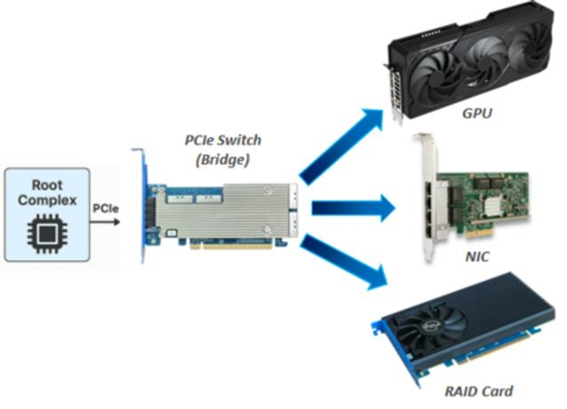
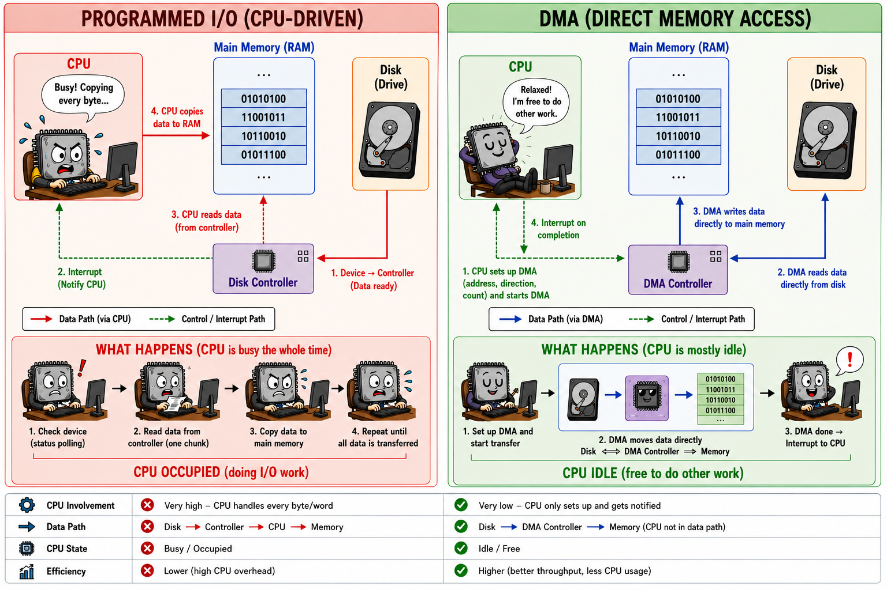

# GPU job submission

> **Module thesis:** there is no *call the GPU* instruction. The CPU tells a device what to do by **reading and writing addresses** — a small, expensive control path — and the device then **moves the bulk data itself**. Every kernel launch, every `.to('cuda')`, every `torch.cuda.synchronize()` is a protocol built out of those two halves — and the cost of that protocol is why the GPU numbers in the last lecture lied to us.

Last lecture was the memory hierarchy **inside one chip**. This one is the memory hierarchy **between two chips**. The next one goes back inside.

We are not going to start with a GPU. We are going to start with a movie file, because that is where your intuition already works — and by the time we have finished arguing about the movie, we will have derived most of a GPU driver.

---

## Who moves the bytes?

You double-click a 4 GB movie file and it starts playing — instantly, smoothly, and you can still browse the web while it plays. Those 4 GB have to travel **disk → RAM → GPU**.

!!! question "💬 Does the CPU execute a load and a store for every one of those bytes?"

    ??? hint "Cost the strawman before answering"
        Let us deliberately build **the stupidest implementation that could possibly work**: the CPU reads one 4-byte word from the disk controller and writes it to RAM, and repeats. Each of those device accesses is a round trip out to the device and back — we'll see when we get to PCIe that the number is about **1 microsecond**:

        ```
        4 GB / 4 B                      = 1.07 × 10⁹ transfers
        × ~1 µs per device round trip   ≈ 1070 s   ≈ 18 minutes
        ```

        **Eighteen minutes of a 100%-busy core to read one movie file** — and zero cycles left over to decode video. Even if a device register were as cheap as DRAM (~80 ns), it is still 86 seconds and a fully saturated core.

        Playback would be impossible. Yet it demonstrably works. **So whatever is happening, it is not this.**

        That number prices *the naive design*, not programmed I/O in general — a real one bursts through a device FIFO and moves far more per round trip. What survives the improvement is the shape: the CPU is in the data path, and its cost grows with the payload.

That style of transfer — the CPU moving the bytes itself with its own load/store instructions — has a name: **programmed I/O (PIO)**. It is not a made-up villain. PC hard drives really were driven this way, and even the batched, FIFO-bursting versions topped out around **16.6 MB/s** (ATA PIO mode 4) with a core pegged. We will find at the end of the lecture that PIO is not dead at all — it lost the data path and kept the control path.

But the strawman argument above is just arithmetic. Let us actually measure it.

### Demo A — the argument: the CPU is not paid per byte

Prepare an 8 GB file once (takes a few seconds):

```bash
dd if=/dev/zero of=~/big.bin bs=1M count=8192 oflag=direct status=progress
```

[`code/gpu_submission/who_pays_per_byte.sh`](https://github.com/Ankush-Chander/DS635-ml-system-engineering/tree/main/code/gpu_submission) reads **the same 512 MB** three times, varying only the request size (`bs`), and records what the CPU is charged for each time:

```bash
./code/gpu_submission/who_pays_per_byte.sh ~/big.bin -q
```

| `bs` | `requests` | **bytes read** | `MB/s` | `IRQs` | `KB/IRQ` | **CPU-seconds** | `% of 1 core` |
|---|---|---|---|---|---|---|---|
| 4K | 131072 | **512 MB** | 119 | 131156 | 4 | **1.374** | 32% |
| 64K | 8192 | **512 MB** | 831 | 8192 | 64 | **0.149** | 24% |
| 4M | 128 | **512 MB** | 1753 | 4086 | 128 | **0.059** | 20% |

**The two bold columns are the argument. Everything else is the explanation.**

**Reading the columns.** Every row moves the same 512 MB. Only `bs` changes.

| Column | Side | What it is |
|---|---|---|
| `bs` | knob | the request size — how many bytes we ask for in one `read()` |
| `requests` | CPU | how many reads that took: 512 MB ÷ `bs` |
| `bytes read` | fixed | 512 MB in every row, by construction — the experiment's control |
| `MB/s` | **device** | throughput achieved — how fast the bytes actually arrived |
| `IRQs` | **device** | interrupts the SSD raised during the run, read from `/proc/interrupts` — the device tapping the CPU on the shoulder to say *"this one's done"* |
| `KB/IRQ` | ratio | data moved per interrupt — how much movement one tap on the shoulder buys |
| `CPU-seconds` | **CPU** | user + system CPU time the read was charged, from `/proc/<pid>/stat` |
| `% of 1 core` | derived | `CPU-seconds` ÷ wall time, where wall time is 512 MB ÷ `MB/s` — how busy one core was while the read ran. **Never above a third, and only a fifth at `bs=4M`**: reading half a gigabyte leaves most of a core free for something else |

*(`bytes read` and `% of 1 core` are worked out here; the script prints the rest.)*

Now the argument — and it needs only the two bold columns above. **Same bytes in every row. CPU cost swings 23×.**

If the CPU were moving the data, that column would be flat — bytes are bytes, and even a maximally efficient copier still pays *per byte*. It is not flat. So **the CPU is not being paid per byte**, and whatever work it is doing is not proportional to the payload.

Be precise about what that buys us. The measurement gives a **symptom** — it kills the strawman without naming what replaced it. The **mechanism** comes from the architecture, and we will read it straight off the hardware two sections from now: the NVMe controller is a **bus master**, so it issues the memory writes itself. *Experiment gives the symptom, architecture gives the mechanism* — worth keeping separate every time you profile something.

No root, no profiler, no special hardware.

!!! question "💬 If the CPU isn't paid per byte, what *is* it being paid for?"

    ??? hint "Answer"
        `CPU-seconds` tracks `IRQs`. Per interrupt the cost is roughly **10–18 µs** and near-constant, even while throughput varies 15×. **The CPU pays per completion, not per byte.** (Not *purely* interrupt handling — syscall, filesystem and block-layer work ride along. The point is that all of it scales with the number of device operations and none of it with the payload.)

        Note that it does *not* track `requests`. The `4M` row issues 64× fewer `read()` calls than the `64K` row, yet takes only 2× fewer interrupts and saves only 2.5× the CPU. What the CPU is billed for is what the **device** did, not what your program asked for.

        And `KB/IRQ` topping out at **128** is the amortization unit: one notification to the CPU buys 128 KB of data movement.


### Two kinds of traffic

So reading a file involves two different kinds of traffic, and they are not moved by the same thing.

- A **few bytes** that the CPU does move itself: *"fetch me sectors 900,000–908,000."* → the **control plane**
- **512 MB** that something else moves: the payload. → the **data plane**

Everything we just measured was the price of the first. The second cost the CPU nothing.

| | **Control plane** | **Data plane** |
|---|---|---|
| Question it answers | how does the CPU *say* anything to a device? | how do the *bytes* actually move? |
| Traffic | a few bytes, rare, latency-sensitive | gigabytes, bulk, bandwidth-sensitive |
| Moved by | the CPU itself | the device itself |
| Mechanism | MMIO writes to device registers | DMA by a bus-mastering engine |

Every term for the rest of this lecture belongs in one column or the other. If you can place a new term in the right column, you have understood the lecture.

Both columns are the same question asked from opposite ends: **how does a CPU talk to a device at all?** The rest of this lecture answers it in four steps — the wire, the address, the bulk transfer, and the protocol that composes them.

---

## How the CPU reaches a device: PCIe

Everything in both columns of that table travels over one link. Before we can price either plane, we need to know what the link actually is.

**Peripheral Component Interconnect Express** connects the CPU to everything that is not RAM: GPUs, NVMe drives, NICs. And despite the name, **it is not a bus.** Legacy PCI was: one shared set of parallel wires, every device electrically attached, one talker at a time, the whole thing clocked down to the slowest participant. PCIe kept the name and the *software* model — configuration space, BARs, `bus:device.function` addressing — for compatibility, and replaced the electrical design entirely with **point-to-point, serial, full-duplex, switched links.** Architecturally it is closer to Ethernet than to a bus.



- **Root complex** — the CPU's gateway to the fabric. It translates CPU loads and stores into PCIe transactions, and routes device traffic into memory.
- **Switch** — fans one link into many; also enables **peer-to-peer** transfers that never touch the CPU or host RAM (this is what GPUDirect is).
- **Endpoint** — a device, identified by **BDF**: `bus:device.function`, e.g. `03:00.0`. That is why `lspci` labels things the way it does, and why a graphics card shows up twice (`.0` the GPU, `.1` its HDMI audio device).

### Everything is a TLP — and this is where the 1 µs came from

Nothing streams across PCIe. Every interaction is packaged into a **Transaction Layer Packet (TLP)** — an envelope carrying *what*, *where*, *how much*, and for a write, the data itself.

A CPU read of a device is two envelopes, one in each direction — and the core cannot proceed until the second one arrives:

```text
NON-POSTED  ── a completion must come back, so the requester waits

CPU ──▶ device      ┌──────┬────────────┬────────┐
                    │ READ │ 0x12345678 │  4 B   │      "give me what is at this address"
                    └──────┴────────────┴────────┘
                              ⋮                         core stalled, ~1 µs
device ──▶ CPU      ┌────────────┬────────────┐
                    │ COMPLETION │ 0xDEADBEEF │          "here it is"
                    └────────────┴────────────┘
```

A write is a single envelope with the payload inside, and nothing comes back:

```text
POSTED  ── no completion, so the CPU hands it off and moves on

CPU ──▶ device      ┌───────┬────────────┬────────┬──────┐
                    │ WRITE │ 0x12345678 │  4 B   │ DATA │      ~100 ns to issue, then done
                    └───────┴────────────┴────────┴──────┘
```

Both ends speak the same language. A **device** originates TLPs exactly the way the CPU does — which is what makes DMA possible at all. (Below the transaction layer sit a data link layer and a physical layer, handling retries and pushing bits. The TLP is the letter; those are the tracking system and the trucks. Ignore them.)

Envelopes come in two categories, and between them they explain the entire cost model of this lecture:

| Category | Examples | Completion required? | Consequence |
|---|---|---|---|
| **Posted** | Memory Write | No — fire and forget | the CPU retires the store immediately; ordering needs explicit fences |
| **Non-posted** | Memory Read, Config Read/Write | **Yes** — a Completion TLP must come back | the requester **stalls for the full round trip** |

**That asymmetry is a protocol category, not an implementation quirk**, and it is the single most load-bearing fact in this lecture. A write to a device costs ~100 ns to issue and then the core moves on. A **read** from a device stalls the core for **~1–2 µs**, uncacheable and unpipelined.

Go back to the strawman we costed at the start. The "~1 µs per transfer" that produced 18 minutes was not a rhetorical exaggeration — it is this row of this table, repeated 1.07 billion times.

**That is enough PCIe for this lecture.** One distinction has to survive — *writes can be fired and forgotten; reads demand an answer* — and everything below is built from it:

- **DMA** = a *device* emitting Memory Write/Read TLPs upstream. "Bus master" means: permitted to originate them.
- **A doorbell** = one posted Memory Write TLP.
- **An MSI-X interrupt** = also a Memory Write TLP, aimed at an address the CPU's interrupt controller watches. Modern PCIe has no interrupt pins — **an interrupt is literally a memory write.**
- **BARs** = the address ranges the root complex uses to *route* memory TLPs to the right endpoint. That is the next section.

---

## How the CPU addresses a device: MMIO and BARs

*The control plane — the smaller half of the movie question: how does the CPU say "fetch me sectors 900,000–908,000" to a disk at all?*

A CPU can do exactly two things to the outside world: **load** from an address, and **store** to an address. There is no `send_to_device` instruction. So the only way to build device communication is to make some addresses mean something other than DRAM.

**The physical address space is not RAM. It is a routing table.**

```
   0x0000_0000  ┌──────────────────────────┐
                │        actual DRAM       │  store → a capacitor changes
                ├──────────────────────────┤
   0xFCB0_0000  │  GPU control registers   │  store → a wire changes inside the GPU
                │        (1 MB)            │
                ├──────────────────────────┤
 0xF800_0000_00 │   GPU VRAM aperture      │  store → travels over PCIe into VRAM
                │        (16 GB)           │
                └──────────────────────────┘
```
```asm
mov [0x1000], eax // lands in DRAM.  
mov [0xFCB00000], eax // becomes a PCIe write TLP routed to the GPU.
```
**Same instruction. Only the address differs.** Nothing is physically present at `0xFCB00000`: the host's address-routing logic sees that the address falls inside a PCIe BAR rather than DRAM, and the root complex forwards the transaction down the link to device `03:00.0`. Addresses that belong to RAM go to the memory controller instead. **The routing decision is made on the address alone.**

Note this is the **physical** address space, below paging. User code never sees it unless the kernel deliberately maps a window into a process.

### BARs, and how they get their addresses

**BAR = Base Address Register** — the statement *"this device owns this range of CPU physical address space."*

Nobody hard-codes those addresses. During **PCI enumeration**, firmware (and then the operating system, which can reassign what firmware chose) walks the fabric and asks every device how much address space it needs; each answers with a size, and gets handed a non-overlapping range that is programmed into its BAR. Only after that does `mov [0xFCB00000], eax` reach the right card. **The address map is assigned during enumeration, not fixed by design** — which is why the numbers below are this machine's, and yours will differ.

Here is the GPU on the machine these numbers came from — real `lspci -v` output, with the long model string trimmed to fit:

```
lspci -v -s 03:00.0

03:00.0 Display controller: AMD/ATI Navi 22 [Radeon RX 6700 ... 6850M XT] (rev cf)
        Subsystem: Micro-Star International Co., Ltd. [MSI] Navi 22
        Flags: bus master, fast devsel, latency 0, IRQ 86, IOMMU group 11
        Memory at f800000000 (64-bit, prefetchable) [size=16G]
        Memory at fc00000000 (64-bit, prefetchable) [size=256M]
        Memory at fcb00000 (32-bit, non-prefetchable) [size=1M]
        Expansion ROM at fcc00000 [disabled] [size=128K]
        Capabilities: <access denied>
        Kernel driver in use: amdgpu
```

Line by line, in plain English:

| What it says | What it means |
|---|---|
| `03:00.0` | the card's address **on the fabric** — bus 03, device 00, function 0. A street address, not a memory address |
| `Display controller: … Navi 22` | what kind of device it is, and which chip |
| `Subsystem: … [MSI]` | who built the *board* around the chip. AMD made the silicon; MSI made the card |
| `bus master` | **this device is allowed to move data by itself.** This one flag is the DMA permission bit — the data plane, switched on |
| `IRQ 86` | the number the device raises to interrupt the CPU when it has finished something |
| `IOMMU group 11` | its protection domain — which regions of RAM its DMA is permitted to touch |
| `Memory at f800000000 … [size=16G]` | **a 16 GB window of address space that is not RAM.** Stores here travel over PCIe into the card's VRAM |
| `Memory at fc00000000 … [size=256M]` | a second 256 MB window — doorbells and framebuffer |
| `Memory at fcb00000 … [size=1M]` | **1 MB of the card's control registers** — the knobs the driver turns |
| `prefetchable` | reads here have **no side effects on the device**, so the platform is free to speculate, prefetch, reorder and combine accesses to this window — which is what makes a multi-gigabyte data aperture usable at all |
| `non-prefetchable` | the device may attach meaning to an *individual* access (a read can clear a status bit), so none of those liberties are safe: accesses must reach it as issued |
| `Expansion ROM … [disabled]` | the card's own boot firmware, switched off once the real driver takes over |
| `Capabilities: <access denied>` | needs `sudo` — link speed and width, MSI-X tables and power states live in here |
| `Kernel driver in use: amdgpu` | which driver claimed the device |

Two of those windows are the whole lecture:

- The **1 MB non-prefetchable** window is the register file — the **control plane**.
- The **16 GB prefetchable** window is a view onto VRAM — the **data plane**. Historically this was capped at 256 MB, a peephole; a full-size aperture means **Resizable BAR** is enabled.

**Now the same command on the disk from the demo:**

```
lspci -v -s 05:00.0
05:00.0 Non-Volatile memory controller: Sandisk WD PC SN540 NVMe SSD 1 TB
        Flags: bus master, fast devsel, latency 0, IRQ 68, IOMMU group 14
        Memory at fce00000 (64-bit, non-prefetchable) [size=16K]
        Memory at fce04000 (64-bit, non-prefetchable) [size=256]
        Kernel driver in use: nvme
```

Same three things: a **bus master** flag, an **IRQ**, and **register windows**. Only the sizes differ — 16 KB of registers instead of 1 MB, and no data aperture at all, because a disk never exposes its storage as address space. This is the device that moved 512 MB for 0.059 seconds of CPU at the start of the lecture. **The mechanism was never GPU-specific.**

Two BARs, two purposes: **commands vs data.** The split we derived from a movie file is sitting right there in `lspci` output.

The driver `ioremap`s the register BAR. The user-mode CUDA/HIP driver gets some of those pages mapped into *your process* — which is why a kernel launch needs no syscall at all.

### What never gets an address: the pendrive

The address map was handed out at boot, by firmware, before you sat down. So there is an obvious objection to everything above.

!!! question "💬 You plug in a USB drive an hour after boot. Which address range does it get?"

    ??? hint "Answer"
        **None. It never gets one.** Nothing in the physical address map changes when you insert it.

        What is memory-mapped is the **USB host controller** — one more PCIe endpoint, with a register BAR assigned at boot exactly like the GPU and the NVMe drive above. The pendrive sits on the far side of it, on a **packet-switched serial bus**:

        ```
           physical address space
           ┌──────────────────────────┐
           │  ...                     │
           │  xHCI registers (BAR)  ◄─┼── assigned at boot, before anything was plugged in
           │  ...                     │
           └──────────────────────────┘
                    │ MMIO      ▲ DMA
                    ▼           │
              [ xHCI controller ]
                    │ USB packets
                    ▼
              [ hub ] ─── [ pendrive ]      ← no address here. ever.
        ```

        Insertion is then handled entirely by machinery this lecture has already built:

        1. **Detect.** The port's electrical state changes. The controller sets a port-status-change bit in *its own* registers and raises MSI-X — which, from the TLP section, is itself just a posted memory write.
        2. **Notice.** The driver reads the event ring **in DRAM**. No new mapping is created; the BAR `ioremap`ped at boot already covers every register involved.
        3. **Address it.** usbcore issues `SET_ADDRESS`, giving the device a number 1–127. That is an address **on the USB wire**, in a namespace disjoint from physical memory. The CPU cannot load or store from it.
        4. **Bind.** Descriptors say mass storage → `usb-storage`/`uas` → SCSI → `/dev/sdb` appears.
        5. **Move data.** The driver builds transfer descriptors in RAM, performs **one MMIO write to a doorbell**, and the controller DMAs the sectors into RAM by itself.

        Step 5 is this lecture's entire protocol, on a third device. The CPU never reads flash through a memory window.

Stated carefully: **the host controller is memory-mapped; a device behind USB is reached through the USB protocol, not by being exposed as a range of CPU physical addresses.** It is the same fact the NVMe `lspci` output showed by having no data aperture, pushed one step further — here not just the storage but the *whole device* sits outside the address space. Other buses arrange this their own way, so check each on its own terms rather than assuming; what generalises is the question to ask: *is this thing addressed, or is it spoken to?*

!!! note "Where hot-plug *does* rewrite the address map"
    **PCIe** hot-plug — a Thunderbolt/USB4 dock, a hot-added NVMe drive. There the kernel must assign real BARs at plug time, and it can only do so if the bridge above reserved a large enough window up front (`pci=hpmemsize=`). Exhaust that window and the device enumerates but gets no BAR, so it is unusable. That failure mode cannot happen to a pendrive, because a pendrive was never going to consume address space in the first place.

    And the one sense in which a pendrive *does* reach memory is pure software: its sectors land in the **page cache**, and `mmap()`ing a file on the mounted filesystem points your PTEs at those pages. A fault there triggers a block read → USB transfer → DMA → page filled. Demand paging, not MMIO — the two meanings of "mapped" are unrelated.

### The cost asymmetry, priced

| Operation | What triggers it | Cost | Why |
|---|---|---|---|
| L1 hit | `s += A[i]` in last lecture's tiled matmul — the line is already in cache | ~1 ns | for scale |
| DRAM read | the same line at N=2048, once `B` stops fitting in L3 | ~80 ns | for scale |
| MMIO **write** | `writel(tail, doorbell)` — the driver telling the GPU *"new work is queued"* | ~100 ns to retire | **posted** — fire and forget, write-combinable |
| MMIO **read** | `readl(status)` — the driver asking the GPU *"are you finished?"* | **~1–2 µs** | **non-posted** — synchronous PCIe round trip, uncacheable, serializing |

**Rule: never ask the device anything; make the device tell you.**

Every design choice in the rest of the lecture follows from that one line. A polling loop over an MMIO status register is catastrophic — a million polls is a second of stalled core. So status is instead written *by the device into DRAM*, where the CPU polls a cache line in its own memory for ~1 ns.

!!! note "The one analogy for this lecture — the kitchen order rail"
    The waiter (**CPU**) writes tickets onto a rail (**ring buffer in DRAM**), rings the bell **once** (**doorbell register, one MMIO write**), and watches the pass for finished plates (**fence value in host memory**).

    Walking into the kitchen to ask "done yet?" is the **MMIO read** — and it is the slow thing. A good waiter never does it.

### Try it on your own machine

```bash
sudo cat /proc/iomem                  # the physical address map, devices interleaved with RAM
lspci -v -s <gpu-bdf>                 # the GPU's BAR windows and their sizes
lspci -v -s <nvme-bdf>                # ...and the disk's, from the demo. Same mechanism, smaller window.
cat /sys/bus/pci/devices/*/resource   # the same BAR table, as text
lsusb -t                              # ...and the devices that own no address at all
```

`/proc/iomem` is where "the address space is not RAM" stops being a claim and becomes a listing you can scroll. Run the GPU/disk pair on your own hardware: the window sizes will differ, the structure will not.

Then plug in a pendrive and re-run `lspci` and `/proc/iomem`: **nothing changes.** It shows up under `lsusb -t`, hanging off a controller whose BARs were fixed at boot — two different addressing worlds, visible in two commands.

---

## How the device moves the bulk: DMA

*The data plane — now the larger half: the 4 GB itself.*


Pic credits: ChatGPT

From demo A: someone other than the CPU must move these bytes, and it must not cost one round trip per word.

**DMA lets a device read and write main memory by itself, with the CPU executing no instructions for the transfer.** The CPU describes the job once — source, destination, length — and the device then issues its own memory transactions until it is done. A device permitted to do this is a **bus master** (that flag in `lspci`), and "issues memory transactions" means exactly what it did in the PCIe section:

```
GPU / NVMe ──▶ Memory Write TLPs ──▶ PCIe fabric ──▶ memory controller ──▶ DRAM
```

The mental correction it forces: **data is not *pushed to* a device by the CPU. The device comes to RAM and takes it.**

```
CPU  (a few hundred ns of work, once):
       write a descriptor — "read 1 GB from sector N into physical 0x8A000000"
       one MMIO write to a doorbell
       context-switch away; run something else entirely

DEVICE (autonomously, for seconds):
       issues memory writes of its own, landing bytes straight in DRAM
       zero CPU instructions executed for this

DEVICE (on completion):
       raises an MSI-X interrupt → driver ISR runs → the blocked process is marked runnable
```

That middle phase is what Demo A measured. **One control-plane transaction buys 128 KB of data-plane movement** — the `KB/IRQ` column, and that ratio is the entire reason the two planes exist as separate mechanisms.

### Three complications, each with a practical consequence

1. **Virtual vs physical addresses.** The DMA engine has no MMU and cannot take a page fault. Your array's virtual address is meaningless to it. A 40 MB user buffer is virtually contiguous but physically scattered across ~10,000 arbitrary 4 KB pages, so the driver builds a **scatter-gather list** — an array of (physical address, length) pairs — and the engine walks it.

2. **Pageable vs pinned (page-locked) memory.** The kernel may swap or migrate a page mid-transfer, which would corrupt memory. So DMA target pages must be **pinned** first. A copy from ordinary pageable memory therefore secretly does *CPU memcpy → driver-owned pinned staging buffer → DMA*: an extra full copy.

    !!! question "💬 This is exactly why two flags exist in every PyTorch training loop. Which ones?"

        ??? hint "Answer"
            ```python
            loader = DataLoader(train_set, batch_size=256, pin_memory=True)

            for x, y in loader:
                x = x.to('cuda', non_blocking=True)
                y = y.to('cuda', non_blocking=True)
                loss = model(x, y)
            ```

            - **`pin_memory=True`** allocates each batch in page-locked memory, so the DMA engine can read it where it lies — no hidden staging copy. How large the win is depends on your hardware and transfer size, so measure it rather than quoting a number — it is a twenty-line experiment.
            - **`non_blocking=True`** lets `.to()` return as soon as the copy is *queued*, so the CPU runs ahead and prepares the next batch while the copy engine works.

            They are one mechanism, not two independent optimizations. `non_blocking=True` can only buy you the full overlap when the source buffer is already fit for asynchronous DMA — in practice, pinned. From pageable memory the runtime must first make the data DMA-safe (a staging copy, possibly temporary pinning), and that work is not free to overlap. Setting it without `pin_memory=True` is the most common way to leave the benefit on the table.

<!--### The IOMMU

An IOMMU is an MMU for devices: it translates device-issued addresses through per-device page tables before they reach memory. (That `IOMMU group 11` in the `lspci` output above.)

- **Protection** — without it, *any* bus-mastering device can write *any* physical address. A malicious or buggy peripheral — or a hostile Thunderbolt dongle — is a total system compromise. This is the DMA-attack class.
- **Convenience** — a physically scattered buffer can be mapped to a contiguous *device* address range.
- **Virtualization** — a VM can be handed a real device safely.

It costs translation latency; it buys isolation.-->

### The movie question, closed

This is what was happening during the `dd` demo: the CPU issued a handful of descriptors, the SSD's DMA engine moved the bytes, and Demo A measured ~20% of one core.

**18 minutes → 3 seconds** — and the difference is not a faster CPU. It is *taking the CPU out of the data path.*

---

### Putting it together: queue, doorbell, completion

We now have two ways for the CPU and GPU to communicate:

* **Ordinary memory + DMA** — good for moving lots of information.
* **MMIO** — good for sending a tiny message to the GPU.

So instead of sending an entire GPU command through MMIO, the CPU does something smarter:

```text
CPU                         GPU

1. Write commands
   into a queue in RAM

   [ A ][ B ][ C ]
              ↑
          new commands

2. Ring doorbell ──────────→ "New work is waiting!"
      (MMIO)

                             3. Read commands
                                from the queue
                                   ↓
                             Execute A, B, C

4. Wait for completion  ←── 5. Mark "done"
```

The three important pieces are:

**1. Ring buffer — "Here is the work."**

The CPU puts GPU commands into a queue in ordinary memory.

```text
RAM

┌─────┬─────┬─────┬─────┬─────┐
│ A   │ B   │ C   │     │     │
└─────┴─────┴─────┴─────┴─────┘
                  ↑
                 tail
```

Writing RAM is cheap, so the CPU can prepare many commands there.

**2. Doorbell — "Go look at the queue."**

Once the commands are ready, the CPU performs **one small MMIO write** to a GPU register:

```text
CPU ─── MMIO write ───→ GPU

        "tail = 3"
```

It doesn't send commands A, B and C through MMIO. It sends only a tiny notification:

> **"I've added work to the queue."**

The GPU then fetches the commands and executes them.

**3. Fence/completion — "I'm done."**

The CPU eventually needs to know when the GPU has finished.

Instead of repeatedly asking the GPU over expensive MMIO:

```text
CPU → "done?"
CPU → "done?"
CPU → "done?"
CPU → "done?"
```

the GPU updates a completion value in memory:

```text
GPU ─── DMA write ───→ RAM

                      completed = 3
```

The CPU can check that memory or sleep until the GPU raises an interrupt.

So the entire protocol reduces to:

```text
       COMMANDS              NOTIFY
CPU ─────────────→ RAM ─────────────→ GPU
        stores                MMIO
                                │
                                ↓
                            executes
                                │
                                │ DMA
                                ↓
CPU ←────────────── RAM ←──── DONE
```

> This ordinary-memory queue is typically implemented as a **ring buffer**. The MMIO notification is called a **doorbell**. The completion value is a **fence**.

!!! question "💬 Why a ring plus one doorbell, instead of one MMIO write per command?"

    ??? hint "Answer"
        PCIe's posted/non-posted asymmetry. Command packets are hundreds of bytes; pushing them through MMIO would be hundreds of posted writes, each unbatched and uncacheable, plus ordering fences. Writing them to DRAM costs ~1 ns each and the *device* fetches them in one burst.

        So the expensive channel carries **one** transaction — an integer — and the cheap channel carries everything else. That is the same trade as `KB/IRQ = 128` on the disk, arrived at from the other direction.

And completion cannot be a poll over PCIe, for the same reason. The CPU polls the **fence value in its own DRAM** (~1 ns, from cache) or sleeps on the interrupt. That distinction is exactly spin-wait vs blocking synchronization (`cudaEventQuery` vs `cudaEventSynchronize`).

### Why the GPU appeared to beat its own peak

Last lecture we timed a matmul at 314 µs and got an implied **55 TFLOP/s on a GPU whose spec sheet says 10.6**. We now have the mechanism to say exactly what was measured.

`C = A_g @ B_g` does three things: append command packets to the ring, write one doorbell, return. A few microseconds of CPU work — **and the GPU may not have started.** The stopwatch stopped when the work was *queued*.

```python
start = time.perf_counter()
C = A_g @ B_g                 # returns once the doorbell is rung
torch.cuda.synchronize()      # ← wait until the fence value reaches my ticket
elapsed = time.perf_counter() - start
```

`torch.cuda.synchronize()` is not a formality. It means *block until the fence value the GPU DMA-writes into host memory is at least my ticket number.* Without it you time the waiter writing the ticket, not the kitchen cooking.

**If a measured throughput comfortably exceeds the hardware's advertised peak, check first whether you measured execution or merely submission.** Other explanations exist — a different precision mode, sparsity, boost clocks, a vendor counting FLOPs its own way — but timing an enqueue is the one that manufactures impossible numbers this cheaply, and it costs one line to rule out.

### What else falls out of the ring

- **A CUDA stream behaves like an ordered command queue.** Work within one stream is ordered; separate streams are independently schedulable, which is what makes overlap possible. **Copy engines are separate queues from compute engines** — that is the mechanism behind prefetching batch *n+1* while computing batch *n*. Events are fences *between* streams. (How streams map onto actual hardware queues is a driver decision, not one ring per stream — take the queue as the mental model, not as the implementation.)
- **Launch overhead is a first-class cost.** ~3–10 µs per launch means a 2 µs kernel is **launch-bound**: the machine is spending more time being told what to do than doing it. This is the honest, mechanical reason for three things you have heard of and never had a reason for:
    - **kernel fusion** — one launch instead of five, and the intermediates never leave the chip;
    - **`torch.compile`** — an automatic fuser;
    - **CUDA Graphs** — pre-record a whole sequence of submissions once, so it can be replayed with a fraction of the per-launch CPU work.

### The callback — it was never a GPU idea

Go back to Demo A's table. Those `requests` and `IRQs` columns were **NVMe submission and completion rings** all along, with **doorbell registers** in the disk's BAR and **completion entries DMA'd back to host memory**. `KB/IRQ = 128` was the amortization we have just spent twenty minutes re-deriving for GPUs.

Identical structure. The same pattern is RDMA NICs, and `io_uring`, and every high-performance device interface of the last fifteen years. It is not a GPU idea; it is **the** device idea — and you measured it on a disk before you believed it about a GPU.

(Mapping a doorbell page directly into user space, skipping the kernel on the submission path, is precisely what **"kernel bypass"** means.)

### And a footnote that closes the opening loop

Programmed I/O is not obsolete. It **lost the data plane and kept the control plane**, because for a handful of bytes, building a descriptor and taking an interrupt costs more than just writing the value:

- **Doorbells** — one posted MMIO write. Textbook PIO, and the cheapest possible signal.
- **Device configuration** — every register poke at init, every BAR write, MSI-X table setup.
- **Small-packet networking** — some NICs expose a write-combining PIO path for tiny frames, where descriptor setup would dominate the payload.

Note the survivors are almost all **writes**. Posted writes are cheap; non-posted reads are designed out of every hot path — which is why completion is signalled by the device DMA-ing a flag into DRAM rather than the CPU ever *reading* a device register.

### Where every term belongs

The two-column board from the start of the lecture, with everything we have added since placed on it. If you can do this from memory, you have the lecture:

| Term | Belongs to |
|---|---|
| BAR, MMIO, doorbell | **control plane** — CPU → device, small and expensive |
| DMA, bus master, scatter-gather, pinning | **data plane** — device → RAM, bulk and cheap per byte |
| TLP, posted vs non-posted | **transport** — how either plane crosses PCIe |
| Ring buffer | the shared structure the two planes meet in |
| Fence value | completion, reported *into DRAM* |
| MSI-X interrupt | notification — and itself a memory write |
| USB address (1–127) | **not an address the CPU can use** — a name on another bus |
| `mmap()` | **a different concept entirely** — virtual memory, not device I/O |

The last two rows are the ones worth guarding. "Mapped" means one thing when the root complex routes a physical address to a device, and something unrelated when the kernel points your page tables at the page cache. The pendrive is where those two meanings get confused.

---

### PyTorch - Hardware-Software mental model
| PyTorch statement                 | Hardware-level mental model                       |
| --------------------------------- | ------------------------------------------------- |
| `torch.tensor(...)`               | CPU stores → DRAM                                 |
| `x.to("cuda")`                    | queue transfer → MMIO doorbell → GPU DMA → VRAM   |
| `x.to("cuda", non_blocking=True)` | queue DMA → CPU continues                         |
| `DataLoader(pin_memory=True)`     | DMA-safe/pinned host pages                        |
| `model.to("cuda")`                | submit transfers that copy the model's CPU-resident tensors into GPU VRAM using the host→device DMA path                    |
| `model(x)`                        | submit GPU commands → doorbell → GPU executes     |
| `loss.backward()`                 | submit backward kernels                           |
| `optimizer.step()`                | submit parameter-update kernels                   |
| `torch.cuda.synchronize()`        | wait for GPU completion/fence                     |
| `torch.cuda.Event`                | marker placed in GPU work stream                  |
| `torch.cuda.Stream()`             | ordered GPU work queue                            |
| `torch.compile()`                 | potentially fewer/larger GPU submissions + fusion |
| CUDA Graph replay                 | reuse pre-recorded submission sequence            |


## References

1. Vijay Janapa Reddi, [*Machine Learning Systems*](https://mlsysbook.ai) — Ch 11: AI Acceleration
2. Linux kernel documentation: `Documentation/driver-api/device-io.rst` and `Documentation/core-api/dma-api.rst`
3. NVMe Base Specification — the submission/completion queue model and doorbell registers. The disk-to-GPU callback in its primary source; the queue-model sections are short and readable.
4. PCI Express Base Specification — configuration space and BAR enumeration (reference, not reading)
5. NVIDIA, [*CUDA C++ Best Practices Guide*](https://docs.nvidia.com/cuda/cuda-c-best-practices-guide/) — asynchronous transfers, streams, CUDA Graphs
