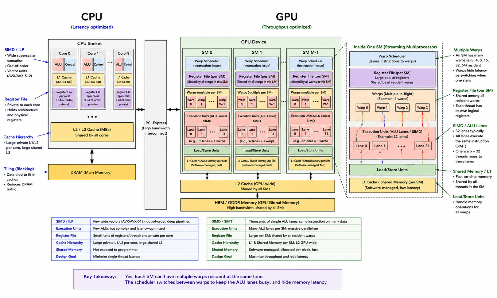

# Inside the GPU: execution and latency hiding

> **Module thesis:** a GPU is not built to make one thread fast — it is built to never have an idle ALU. This lecture is the machinery that achieves that.

This is the first of two lectures on GPU internals. It asks **how a GPU keeps thousands of ALUs busy**: the execution model, the scheduler, and the latency hiding that everything else is built around. [Lecture 8](Lecture8.md) asks the other half — **what limits performance** once the ALUs are busy.

---

## The central question

A GPU has thousands of arithmetic lanes.

But arithmetic is cheap compared with waiting for memory.

A trip to DRAM can take **hundreds of cycles**. So how can a GPU keep thousands of arithmetic units busy?

The answer is the organizing principle for everything in this lecture:

> **The GPU is not trying to make one thread fast. It is trying to never have an idle ALU.**

The rest of this lecture explains how the hardware achieves that, and what the programming model charges you for it.

---

## 1. The machine

### CPU versus GPU



A CPU spends a large fraction of its transistor budget making **one or a few instruction streams progress quickly**:

* out-of-order execution
* branch prediction
* speculation
* large caches
* sophisticated control logic

A GPU makes a different trade:

> **Spend silicon on arithmetic lanes and keep many independent pieces of work in flight.**

The two machines are solving the same problem—execute instructions—but they use very different strategies for dealing with latency.

```text
CPU

one thread
    │
    ├── branch prediction
    ├── speculation
    ├── out-of-order execution
    └── large caches
             │
             ▼
       make this thread fast


GPU

many threads
    │
    ├── warp 0 ──┐
    ├── warp 1   │
    ├── warp 2   ├──► keep the ALUs busy
    ├── warp 3   │
    └── ... ─────┘
             │
             ▼
       hide latency with parallelism
```

---

### The GPU in this laptop

Zooming in on the discrete GPU:

```text
GPU
│
├── VRAM  10.7 GB
│
└── 36 × Compute Unit
       │
       ├── 2 × SIMD
       │     ├── 32 ALU lanes
       │     ├── register file
       │     └── scheduler
       │
       ├── L1
       └── shared memory / LDS
```

The important question is not yet what every box is called.

It is:

> **Why does the GPU need all of these boxes?**

The answer emerges as we follow one piece of work from a program down to the hardware. For now we need just enough vocabulary to describe execution — the cache hierarchy can wait for [Lecture 8](Lecture8.md).

---

### The hardware vocabulary

**ALU lane**

One arithmetic unit.

It performs operations such as multiply, add, or fused multiply-add.

**SIMD**

A group of arithmetic lanes that execute the same instruction together.

**Compute Unit**

The repeating execution building block of the GPU.

A CU contains arithmetic lanes, registers, scheduling machinery, cache, and shared memory.

NVIDIA calls the corresponding structure an **SM — Streaming Multiprocessor**.

**Register file**

Fast per-thread storage holding the live state of resident threads.

It is unusually large because the GPU wants to keep the state of many threads resident simultaneously.

**Shared memory**

A small, explicitly managed scratchpad available to a group of threads.

On AMD this is called **LDS — Local Data Share**.

**VRAM**

The GPU's own DRAM.

It has much higher bandwidth than typical system memory, but it is still vastly slower than registers.

Most literature uses NVIDIA's vocabulary; `rocminfo` reports AMD's. This module uses **warp**, **SM**, and **shared memory** for the general programming model, and points out AMD terminology where it matters. The full correspondence is in [Appendix A](#appendix-a-nvidia-and-amd-terminology).

---

## 2. How software becomes parallel work

Before understanding how the GPU hides latency, we need to understand what it actually schedules.

### Thread → warp → block → grid

You normally write code for one logical **thread**.

For example:

```text
thread:
    C[i] = A[i] + B[i]
```

You do not write:

```text
run this instruction on ALU 0
run this instruction on ALU 1
run this instruction on ALU 2
...
```

Instead, the programming model describes a large collection of threads.

```text
thread
   │
   ▼
warp / wavefront
   │
   ▼
block / workgroup
   │
   ▼
grid
```

**Thread**

One logical instance of your program.

**Warp / wavefront**

A fixed-size group of threads that execute instructions together.

NVIDIA commonly uses **32-thread warps**.

AMD hardware can use **32- or 64-thread wavefronts**, depending on the architecture.

The important idea is:

> **The hardware schedules groups of threads, not independent CPU-like threads.**

**Block / workgroup**

A group of threads that is scheduled together and can cooperate through shared memory.

A resident block is assigned to one compute unit at a time.

**Grid**

All the blocks required to cover the problem.

---

### SIMT: SIMD with the vector hidden

An AVX2 instruction on a CPU operates on eight float lanes at once:

```text
one instruction
      │
      ▼
┌─────┬─────┬─────┬─────┬─────┬─────┬─────┬─────┐
│ f32 │ f32 │ f32 │ f32 │ f32 │ f32 │ f32 │ f32 │
└─────┴─────┴─────┴─────┴─────┴─────┴─────┴─────┘
```

You explicitly program vectors, or rely on the compiler to generate them.

GPU programming hides the vector.

You write scalar code:

```text
thread 0: C[0] = A[0] + B[0]
thread 1: C[1] = A[1] + B[1]
thread 2: C[2] = A[2] + B[2]
...
```

The hardware groups the threads:

```text
32 threads
      │
      ▼
one instruction
      │
      ▼
32 lanes execute together
```

This is **SIMT — Single Instruction, Multiple Threads**.

The programming interface looks like independent scalar threads.

The hardware executes them in groups.

> **SIMT is SIMD with the vector hidden.**

That gap between the programming model and the hardware is responsible for several important GPU performance effects — and for the correction in the next section.

---

### A CUDA core is not a core

"2,304 cores" invites a misleading picture:

```text
2,304 tiny CPUs
```

That is not what the GPU contains.

There are compute units that contain scheduling and control machinery, and thousands of arithmetic lanes that those units drive.

A CUDA core / shader ALU is therefore better thought of as:

> **one arithmetic lane, not one independent processor.**

It has no independent program counter and cannot fetch and execute an independent program.

Prefer:

```text
2,304 FP32 ALUs
```

over:

```text
2,304 cores
```

when describing what the silicon actually contains.

!!! question "💬 If a CUDA core is not a core, what *is* the smallest thing on a GPU that has its own program counter?"

    ??? hint "Answer"
        The **warp**, not the thread and certainly not the lane. A warp has one instruction stream and one program counter shared by its 32 lanes. That single fact is the source of both of the effects we meet later in this lecture: divergence (when lanes disagree about where the program counter should go) and the cheapness of warp switching (when the scheduler picks a different warp's program counter).

---

## 3. How much hardware is actually here?

Now that the vocabulary is in place, the numbers become meaningful.

### Read your own GPU

```bash
rocminfo                 # AMD
nvidia-smi -q            # NVIDIA
```

On this machine:

```text
Marketing Name:          AMD Radeon RX 6700M
Compute Unit:             36
SIMDs per CU:             2
Wavefront Size:           32
Max Waves Per CU:         32
Workgroup Max Size:       1024
L1:                       16 KB
L2:                       3 MB
L3:                       96 MB
LDS (shared memory):      64 KB
Cacheline Size:           128 B
VRAM:                     10.7 GB
```

Two derived numbers explain much of what follows.

---

### Arithmetic capacity

Each compute unit has:

```text
2 SIMD × 32 lanes = 64 FP32 ALUs
```

Across 36 compute units:

```text
36 CU × 2 SIMDs × 32 lanes
= 2,304 FP32 ALUs
```

At 2.3 GHz, with 2 FLOPs per fused multiply-add:

```text
2,304 × 2 × 2.3 GHz
≈ 10.6 TFLOP/s
```

That is the theoretical FP32 compute roof. We will need it again in Lecture 8.

---

### Resident work

Each CU can hold up to 32 waves of 32 threads:

```text
32 waves × 32 threads
= 1,024 resident threads per CU
```

Across 36 CUs:

```text
36 × 1,024
= 36,864 resident threads
```

Put the two numbers together:

> **1,024 threads can be resident on a CU, while 64 FP32 ALUs execute them.**

The GPU deliberately keeps **16× more work loaded than it can execute at any instant**.

Why build the machine that way?

The answer is **latency hiding**.

---

## 4. The GPU's trick: latency hiding

This is the heart of the lecture. Everything before it was vocabulary; everything after it is a consequence.

### The problem

Consider a thread executing:

```text
load A[i]
compute
compute
compute
```

A floating-point instruction can be issued very quickly.

A trip to DRAM can take hundreds of cycles.

```text
FMA:
    █

DRAM:
    █████████████████████████████████████████████████
```

If the GPU had only one thread, its arithmetic units would spend most of their time waiting.

A CPU attacks this problem by making one instruction stream sophisticated enough to continue making progress — out-of-order execution, speculation, prefetch.

A GPU uses a completely different strategy.

---

### The GPU does not wait

> **The GPU does not wait. It runs somebody else.**

Suppose warp 0 issues a memory load:

```text
warp 0
    │
    └── load from DRAM
             │
             │ waiting
             ▼
        scheduler
             │
             ├── warp 1 ──► execute
             │
             ├── warp 2 ──► execute
             │
             ├── warp 3 ──► execute
             │
             └── ...
```

The scheduler examines resident warps and chooses one that is ready to execute.

When warp 0 is waiting for memory, it simply becomes ineligible.

When its data arrives, it becomes eligible again.

From the ALUs' point of view:

```text
warp 0 waits
     ↓
warp 1 runs
     ↓
warp 2 runs
     ↓
warp 3 runs
     ↓
warp 0 becomes ready
```

The GPU converts **memory latency** into **parallel work**.

---

### Why so many threads must be resident

Imagine DRAM takes roughly 400 cycles.

If the GPU wants to keep its arithmetic lanes busy during those 400 cycles, it needs other instructions to issue while the first warp waits.

That single requirement forces most of the GPU's design:

```text
DRAM takes hundreds of cycles
          │
          ▼
don't wait
          │
          ▼
run another warp
          │
          ▼
many warps must be resident
          │
          ▼
their state must already be available
          │
          ▼
register file holds their live state
```

Read that chain in the other direction and it explains the hardware: the register file is enormous *because* warp switching must be free, and warp switching must be free *because* the ALUs must never idle.

The GPU has paid for latency hiding in silicon.

---

### Why warp switching is so cheap

An operating system context switch usually involves moving or reconstructing state:

```text
thread A
    │
    ├── save registers
    ├── change stack/context
    ├── possibly change address space
    └── resume thread B
```

That is expensive.

A GPU warp switch does not need a comparable save/restore operation.

The live register state of resident warps is already sitting in the register file.

So switching from:

```text
warp 0 → warp 1
```

is essentially a scheduling decision:

> **Choose a different set of already-resident registers for the next instruction.**

The GPU has converted a recurring context-switch cost into a one-time silicon cost:

> **Build a register file large enough to hold the state of many resident threads.**

Concretely, on this GPU:

```text
L1:
    16 KB per CU

Vector register file:
    128 KB per SIMD
    ≈ 256 KB per CU
```

The register file is **larger than the L1 cache beside it** — an inversion that would look absurd on a CPU. It is not a cache at all. It is the seat of the resident warps, and therefore the mechanism that makes cheap warp switching possible.

---

### How much latency does this actually hide?

Do not make the mistake:

```text
16× oversubscription
        ↓
400 cycles hidden
```

That does not follow.

A better approximation is:

```text
latency hiding
    ≈
resident warps
×
independent requests in flight per warp
```

Caches absorb some of the latency, and the amount of useful work available while a warp waits depends heavily on the kernel.

The key idea is:

> **Oversubscription provides opportunities for latency hiding. It does not guarantee that all latency disappears.**

---

## 5. The price of SIMT: divergence

The execution model is powerful, but the shared instruction stream sends you a bill.

### Warp divergence

Consider:

```cpp
if (x > 0)
    a();
else
    b();
```

Suppose exactly half of a 32-thread warp takes each branch.

```text
32 threads
    │
    ├── 16 → A
    └── 16 → B
```

The hardware cannot execute both paths simultaneously, because the warp shares one instruction stream and one program counter.

Instead:

```text
Step 1:

execute a()

16 lanes → active
16 lanes → masked


Step 2:

execute b()

16 lanes → masked
16 lanes → active
```

Both paths execute.

Every lane is occupied during both passes, but half of the lanes are inactive during each pass.

This is **warp divergence**.

---

### Divergence is per warp

Divergence is not determined by whether a branch exists.

It depends on whether threads **within the same warp** disagree.

For example:

```cpp
if (tid < 32)
```

If the warp is aligned with those 32 threads, every thread in the warp agrees.

No divergence.

But:

```cpp
if (tid % 2)
```

splits every warp into two groups.

Both paths execute.

Same branch syntax.

Very different hardware cost.

The extreme case is a 32-way split:

```text
32 different paths
        ↓
32 sequential executions
```

---

### But divergence does not automatically mean slower

!!! question "💬 A divergent kernel issues roughly twice the instructions of the non-divergent one. Predict the slowdown."

    ??? hint "Answer"
        **About 1.08×**, not 2×. Measured on the RX 6700M:

        ```text
        warp agrees, one path runs           :   1.200 ms
        warp splits on (lane % 2)            :   1.297 ms
        2x instructions, one dependent chain :   2.543 ms
        ```

        Doubling the instructions *along a dependent chain* costs 2.12×. Doubling them *across two independent paths* costs 1.08×. The instruction count is identical in both cases — so instruction count is not what you are being billed for.

The divergent version issues roughly twice as many instructions, but takes only:

```text
1.297 / 1.200 ≈ 1.08×
```

The dependent-chain version takes:

```text
2.543 / 1.200 ≈ 2.12×
```

Why?

---

### The machine had spare issue capacity

The single-path kernel was a long dependent chain.

Each operation depended on the result of the previous one.

Therefore many issue opportunities were already going unused.

The divergent kernel added another independent path.

Its extra instructions could occupy those otherwise-empty slots.

So:

```text
single path:
    useful instruction
    wait
    useful instruction
    wait
    ...

divergent:
    path A instruction
    path B instruction
    path A instruction
    path B instruction
    ...
```

The important lesson is:

> **Divergence bills you in issue slots. Whether that costs you time depends on whether the machine had spare slots.**

Stated more generally, and worth carrying beyond GPUs:

> **Instruction count is not execution time.**

This is why:

> "Avoid all branches on GPUs"

is bad advice.

Measure the kernel.

---

## 6. Occupancy: how much work can be resident?

The GPU needs enough resident warps to hide latency.

But resident work consumes resources.

The main budgets are:

* registers
* shared memory
* maximum resident waves
* maximum threads
* architectural limits per block/workgroup

For example:

```text
more registers per thread
        ↓
fewer threads fit
        ↓
fewer resident warps
        ↓
fewer candidates for the scheduler
        ↓
less latency hiding
```

Similarly:

```text
more shared memory per block
        ↓
fewer blocks can fit on a CU
        ↓
fewer resident warps
```

On this GPU:

```text
32 waves per CU
64 KB LDS per workgroup
```

A block requesting 32 KB of shared memory can therefore be limited to:

```text
64 KB / 32 KB = 2 blocks resident per CU
```

even if registers would otherwise allow more.

---

### Is low occupancy bad?

Suppose a profiler reports:

```text
25% occupancy
```

Is that automatically a problem?

No.

Occupancy is only one ingredient in latency hiding.

The real goal is:

> **Have enough independent work in flight to cover the latency generated by this kernel.**

A kernel with:

* high arithmetic intensity
* lots of instruction-level parallelism
* many registers per thread

may run very well at low occupancy.

Reducing register usage simply to increase occupancy can even make things worse if it causes register spills to memory.

Therefore:

> **Occupancy is a diagnostic to read when something is slow, not a score to maximize.**

---

## Where this lecture leaves us

We can now answer the question we opened with.

The GPU keeps thousands of ALUs busy by keeping thousands of threads *resident*, and switching between them for free whenever one stalls. Everything else in this lecture followed from that: the enormous register file, the warp as the unit of scheduling, the divergence bill, the occupancy budget.

```text
many ALUs
    ↓
many resident warps
    ↓
cheap warp switching
    ↓
latency hiding
```

But we have only solved half of the problem.

We have explained what the GPU does **while it waits for data**. We have not asked where that data comes from, or whether the memory system can supply it fast enough to keep this whole machine fed.

> **Next — [Lecture 8](Lecture8.md): memory, bandwidth, and the roofline — and why LLM decode is memory-bound while training on the same GPU is compute-bound.**

---

## Run it yourself

Inspect your GPU:

```bash
rocminfo
# or
nvidia-smi -q
```

Inspect clock levels on Linux/AMD:

```bash
cat /sys/class/drm/card*/device/pp_dpm_sclk
cat /sys/class/drm/card*/device/pp_dpm_mclk
```

Run the benchmark:

```bash
python code/gpu_internals/warp_costs.py
```

The benchmark code:

[`code/gpu_internals/warp_costs.py`](https://github.com/Ankush-Chander/DS635-ml-system-engineering/tree/main/code/gpu_internals)

The Triton benchmark is designed to run across NVIDIA and AMD hardware and can also be run on a free Colab/Kaggle GPU.

---

<!--# Exercises

## 1. Make divergence hurt

Run the divergence benchmark.

The original divergent kernel costs only about:

```text
1.08×
```

because the two paths contain independent work.

Modify the paths so that they form a dependency chain.

Measure again.

Explain why the same instruction-count increase now costs much more time.

---

## 2. Count your own resident work

From `rocminfo` or `nvidia-smi -q` on your own GPU, derive:

```text
ALUs per CU/SM
resident threads per CU/SM
oversubscription ratio
```

How many warps must stall simultaneously before your GPU runs out of eligible work?

----->

## Appendix A — NVIDIA and AMD terminology

| NVIDIA                        | AMD / ROCm                    |
| ----------------------------- | ----------------------------- |
| SM — Streaming Multiprocessor | CU — Compute Unit             |
| warp                          | wavefront                     |
| CUDA core                     | stream processor / shader ALU |
| shared memory                 | LDS — Local Data Share        |
| thread block                  | workgroup                     |
| warp scheduler                | SIMD scheduler                |
| tensor core                   | matrix core                   |

The exact internal organization differs between architectures, so these should be treated as corresponding concepts rather than literally identical hardware.

The names differ, but the important concepts are:

```text
many arithmetic lanes
        +
thread groups
        +
resident state
        +
scheduler
        +
fast local memory
        +
large-bandwidth memory
```

---

## Appendix B — This laptop's GPUs

`rocminfo` reports two GPUs in the same machine:

|                  | RX 6700M | Integrated Radeon Graphics |
| ---------------- | -------: | -------------------------: |
| Compute Units    |       36 |                          8 |
| SIMDs per CU     |        2 |                          4 |
| Wavefront size   |       32 |                         64 |
| Max waves per CU |       32 |                         40 |

The same laptop therefore contains two AMD GPUs with different wavefront widths.

This is a useful reminder:

> **A warp/wavefront width is an architectural design choice, not a universal law.**

Code that blindly assumes one particular width is making a hardware assumption.

---

## References

1. Vijay Janapa Reddi, [*Machine Learning Systems*](https://mlsysbook.ai) — Ch. 11: AI Acceleration
2. NVIDIA, [*CUDA C++ Programming Guide*](https://docs.nvidia.com/cuda/cuda-c-programming-guide/) — Hardware Implementation, SIMT, divergence, occupancy
3. AMD, [*RDNA 2 Instruction Set Architecture Reference Guide*](https://gpuopen.com/amd-gpu-architecture-programming-documentation/) — compute units, wavefronts, vector register file
4. [Triton documentation](https://triton-lang.org)
5. Course code: [`code/gpu_internals`](https://github.com/Ankush-Chander/DS635-ml-system-engineering/tree/main/code/gpu_internals)
