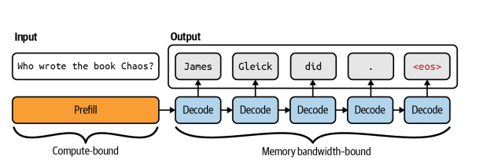
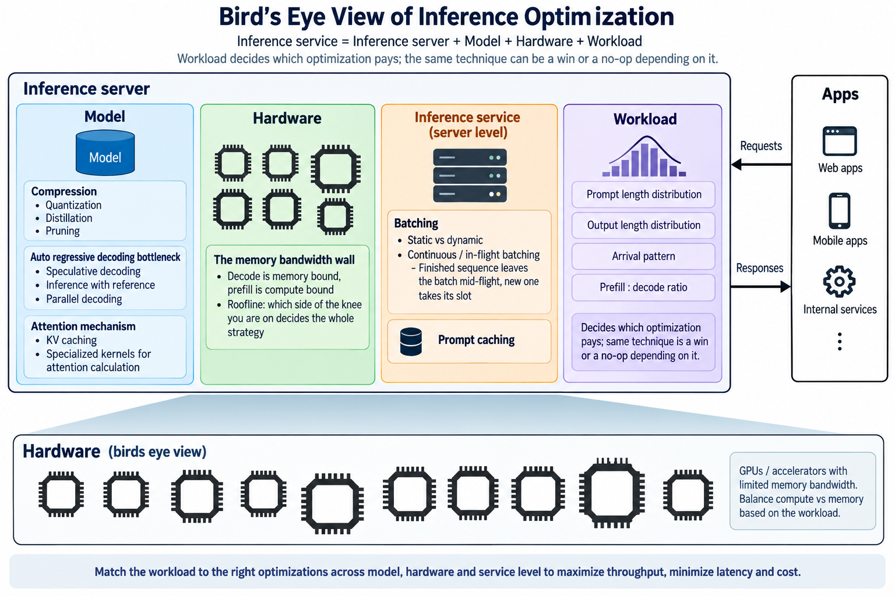

# Inference optimization

## 0. The question this lecture answers

!!! quote "The problem"
    *"I run an agentic workload on an **NVIDIA RTX A6000** with **Qwen3 27B at FP8**. I am not happy with the speed. Will buying a **DGX Spark** or an **Apple M3 Max** improve it?"*


---

## 1. Types of workloads

The same model on the same GPU behaves like three different systems depending on who is waiting for it.

| Workload | Shape | Arrival | Batch opportunity | Judged on |
|---|---|---|---|---|
| **Online / interactive** | one request, streamed, user waiting | unpredictable, bursty | only what arrives in a few ms | time to first token, then steady per-token latency |
| **Batch** | thousands of requests, nobody waiting | all known up front | unlimited | throughput per rupee |
| **Embedding** | short inputs, no generation at all | either | unlimited | rows per second |

!!! question "💬 Which of the three is *not* autoregressive — and what does that change?"

    ??? hint
        Embedding has no decode phase. It never touches the bottleneck the rest of this lecture is about, which is exactly why it behaves so differently on the same GPU.

        One forward pass in, one vector out. No token-by-token loop, no KV cache, no re-reading the weights per output token. It is **prefill only** — which puts it on the *compute-bound* side of §4 permanently.

### The choice is a scheduling decision, not a model decision

Nothing about the weights changes between the first two rows. What changes is **whether anyone is waiting**, and that single fact decides how large a batch you are allowed to form.

- Online serving cannot wait for a full batch, so it runs the GPU at low occupancy and pays for it.
- Batch serving can wait as long as it likes, so it runs the same GPU near its bandwidth ceiling.

!!! note "This is why a batch tier exists at all"
    A workload shaped as *"submit your requests, collect results in the morning"* needs a **queue**, not a GPU per user. That is the design point of every commercial batch API: the same hardware, several times the throughput, bought entirely with latency you were not using.

!!! warning "Mixing them on one GPU is not free"
    A long batch job and an interactive request on the same device contend for the same bandwidth. The batch job barely notices. The interactive user sees their TTFT triple. Isolation is a scheduling problem, and §2 is how you would even detect it.

### Classify these

!!! question "💬 Online, batch, or embedding? Take each one in turn."

    1. Autocomplete in a code editor
    2. Building a semantic search index over 2 million documents
    3. Embedding a user's search query when they hit enter
    4. Grading 400 student assignments with an LLM judge
    5. Generating alt-text for every image already in a CMS
    6. Translating a document the user just uploaded and is waiting for
    7. A coding agent working through a 40-step task on its own

    ??? hint "The last two are the interesting ones"
        | | Class | Why |
        |---|---|---|
        | 1. Editor autocomplete | **online** | TTFT is nearly the whole experience; the answer is a few tokens |
        | 2. Index 2M documents | **embedding, batch** | nobody waiting, unlimited batch, prefill only |
        | 3. Embed one query | **embedding, online** | same model as row 2, opposite constraint |
        | 4. Grade 400 assignments | **batch** | all inputs known up front, deadline is tomorrow |
        | 5. Alt-text for a CMS | **batch** | the content already exists; there is no user in the loop |
        | 6. Translate an uploaded doc | **online, but TPOT-bound** | someone *is* waiting, yet the output is long enough that TTFT barely matters |
        | 7. A 40-step agent | **neither, cleanly** | no human waits on any single step, but total wall-clock is a user-visible number |

        **Rows 2 and 3 are the point.** Same model, same operation, opposite classification —
        decided entirely by whether anyone is waiting. Nothing about the weights changed.

        **Row 7 is the honest edge case.** An agent is a *sequence* of online calls that
        collectively behave like a batch job. It is why §5's problem is hard, and why
        "just batch it" is not automatically available: step 12 needs step 11's output.

!!! tip "The classification is the first design decision"
    It fixes your batch size ceiling, which fixes your achievable throughput, which fixes
    what hardware you need. Get it wrong and every number downstream is answering a
    different question.

---

## 2. Metrics


### Latency — *how long does one user wait?*

| Metric | Definition | Set by |
|---|---|---|
| **TTFT** | **t**ime **t**o **f**irst **t**oken | prefill: prompt length, batch queueing |
| **TPOT** | **t**ime **p**er **o**utput **t**oken, after the first | decode: memory bandwidth |

The user-visible number is neither of them alone:

```
  total latency  =  TTFT  +  TPOT × (output tokens − 1)
```

Which of the two terms dominates depends entirely on output length — we put numbers
on that in §4, once we can price both.

### Throughput — *how much work does the machine finish?*

- **RPS / RPM** — requests per second / requests per minute. The operations number.
- **tokens/s** — the honest one for LLMs, because requests are not the same size.

!!! danger "RPS hides request size"
    Ten requests of 20 tokens and ten of 2000 tokens are the same RPS and a 100× difference in work. Quote tokens/s, and say whether you mean *output* tokens or *prompt + output*.

### Utilization — *how much of the machine did you actually use?*

Two ratios, each asking what fraction of one resource's ceiling you converted into work:

- **MFU — Model FLOP/s Utilization.** The share of the GPU's *compute* ceiling you reached.
- **MBU — Memory Bandwidth Utilization.** The share of its *bandwidth* ceiling you reached.

```
              achieved FLOP/s                    bytes moved per second
  MFU  =  ──────────────────────        MBU  =  ────────────────────────────
               peak FLOP/s                        peak memory bandwidth
```

**MFU** is the right meter for prefill and training. **MBU** is the right meter for decode. Reading the wrong one is the most common way to conclude a GPU is idle when it is saturated:

!!! question "💬 `nvidia-smi` shows 95% utilization during decode. Is the GPU busy?"

    ??? hint "It shows occupancy of the scheduler, not of the machine"
        That number reports *whether any kernel was resident*, not whether it accomplished anything. During decode you can sit at 95% "utilization", **4% MFU** and **70% MBU** simultaneously — all three are true, and only the last one is telling you where the time went.


!!! danger "Metrics become targets"
    Mean latency hides the tail — report **p50, p95, p99**, because the p99 user is the one who leaves. Tokens/s hides how many of them anyone waited for. State the workload before quoting the number.


---

## 3. Prefill vs decode



The central mechanism of the lecture.

- **Prefill** — the whole prompt in one pass, builds the KV cache, sets **TTFT**
- **Decode** — one token per forward pass, re-reading all the weights each time, sets **TPOT**

Hold on to that asymmetry: one pass over the prompt, then one pass over the weights
*per token*. §4 gives it a name and a number.

### Why the phases scale differently

Prefill's work is set by **how much prompt there is** — double the prompt and you double the FLOPs, so TTFT roughly doubles with it. Decode's work per token is **fixed**: one pass over the weights, regardless of how long the prompt was or how long the answer will be, so TPOT barely moves.

That asymmetry is why the two are optimized separately. Prompt caching attacks TTFT and does nothing for TPOT; a smaller model attacks TPOT and barely touches TTFT.


### Consequence: the two phases want opposite things

Prefill wants to be compute-bound and long. Decode wants a big batch and short weights. Serving both in one loop means one of them is always being starved — which is why modern servers **chunk prefill** into decode steps, or **disaggregate** the two phases onto different machines entirely.


---

## 4. Bottlenecks: compute vs memory vs bandwidth

Recall the roofline from Lectures 3_4 and 8. The ridge point is where a machine stops being bandwidth-limited and starts being compute-limited:

```
                    peak FLOP/s
  ridge point  =  ─────────────────       (FLOP per byte)
                   peak bandwidth
```

!!! example "Running example — the machine from §0"
    **Qwen3 27B at FP8** (27 GB of weights) on an **RTX A6000**: 48 GB GDDR6, **768 GB/s** of bandwidth, **~155 TFLOP/s** of dense FP16 tensor throughput.

    Ridge point = 155 × 10¹² / 768 × 10⁹ ≈ **202 FLOP/byte**. Anything below that line is memory-bound.

    We keep this machine for the rest of the lecture, so the numbers here are the ones §5 spends.

### Three bottlenecks, not two

| Bottleneck | The limit | Symptom |
|---|---|---|
| **Compute** | FLOP/s | high MFU, adding batch does not help |
| **Bandwidth** | bytes/s | high MBU, low MFU — the decode case |
| **Capacity** | bytes | it does not run at all, or the KV cache evicts |

Bandwidth and capacity are both "memory" and are completely different failures. Capacity decides *whether* the model runs; bandwidth decides *how fast*.

!!! note "A spec-sheet detail worth catching"
    The A6000 is Ampere, which has **no FP8 tensor path**. An FP8 model is *stored* at one byte per parameter and upconverted for the arithmetic, which runs in fp16. The bandwidth saving is real — that is the half we are costing. The FLOP/s number is the fp16 one.

### Where prefill and decode land

Both phases read the same 27 GB of weights. Only the FLOPs differ:

| Phase | FLOPs per pass | Bytes read | Arithmetic intensity | Verdict |
|---|---|---|---|---|
| **Prefill**, 512-token prompt | 2 × 27e9 × 512 ≈ **27.6 TFLOP** | 27 GB | **≈ 1024** FLOP/byte | 5× above ridge → **compute-bound** |
| **Decode**, 1 token | 2 × 27e9 ≈ **54 GFLOP** | 27 GB | **≈ 2** FLOP/byte | 100× below ridge → **memory-bound** |

At 768 GB/s those 27 GB take **35 ms** to read, so decode tops out near **28 tokens/s** — hold on to that number, it is the answer to §0.


!!! question "💬 Same model, same GPU — why is the first token slow and the rest fast?"

    ??? hint "Now put a number on §3's asymmetry"
        The two phases sit on **opposite sides of the roofline knee** — 1024 against 2, either side of a ridge at 202. That is the whole answer, and it is why the rest of the lecture is about decode.

        The identity worth remembering:

        ```
          arithmetic intensity  ≈  2 × tokens in the pass ÷ bytes per parameter
        ```

        At FP8 that is 2 × 512 = 1024 for this prefill, and 2 × 1 = 2 for a decode step.

### From intensity to wall-clock

Each row of that table binds against a different resource, so each becomes a different
division. **Prefill is compute-bound, so price it against FLOP/s. Decode is memory-bound,
so price it against bandwidth.**

```
            2 × params × prompt tokens                    model bytes
  TTFT  ≈  ────────────────────────────      TPOT  ≈  ───────────────────
                FLOP/s  ×  MFU                          bandwidth  ×  MBU
```

For the A6000 with a 512-token prompt, at realistic efficiencies (prefill rarely exceeds
**50% MFU**, decode **70% MBU**):

| | Ideal | Realistic |
|---|---|---|
| **TTFT** = 27.6 TFLOP / 155 TFLOP/s | 179 ms | **357 ms** @ 50% MFU |
| **TPOT** = 27 GB / 768 GB/s | 35.2 ms | **50 ms** @ 70% MBU |

!!! question "💬 Which of those two numbers should we work on?"

    ??? hint "It depends entirely on how long the answers are — §2's crossover, with numbers"
        | Answer length | TTFT | Decode | Total | TTFT share |
        |---|---|---|---|---|
        | 20 tokens | 357 ms | 0.95 s | **1.31 s** | **27%** |
        | 200 tokens | 357 ms | 10.0 s | **10.35 s** | 3.4% |
        | 500 tokens | 357 ms | 25.1 s | **25.42 s** | 1.4% |

        Halving TTFT on the 20-token workload wins you 14% of the wall clock.
        Halving it on the 500-token workload wins you 0.7% — nothing.

        **This is why the first thing to establish about an inference workload is its
        output length distribution**, not its model or its hardware.

!!! warning "TTFT is not only compute"
    On a loaded server, time-to-first-token also contains **queue wait** — how long the
    request sat before prefill started. Under load that term routinely exceeds the 357 ms
    of arithmetic above. The formula gives you the floor, not the number your user sees.

### Batch size is the knob that moves you along the roofline

Add sequences to a decode batch and the weights are still read **once**. FLOPs scale with the batch; bytes do not:

```
  decode arithmetic intensity  ≈  2 × batch size ÷ bytes per parameter
```

At FP8 that is simply **2 × batch size**.

!!! question "💬 What batch size would make decode compute-bound on our example card?"

    ??? hint
        Ridge point is 202 FLOP/byte and decode's intensity is 2 × batch, so you need **batch ≈ 101** before decode stops being a bandwidth problem.

        That is the entire economic argument for batching, and the reason a batch tier gets several times the tokens/s out of hardware you already own. It is also why single-user local inference feels slow on a card that benchmarks well.

        Note what quantization does to that threshold: fewer bytes per parameter means *higher* intensity, so a 4-bit build reaches the ridge at **batch ≈ 50** instead of 101. Compression buys batch headroom as well as bandwidth.


---

## 5. Answering the question

Back to the message from §0. Everything since then has been building the two
numbers this needs.

!!! quote "The problem"
    *"I run an agentic workload on an **NVIDIA RTX A6000** with **Qwen3 27B at FP8**. I am not happy with the speed. Will buying a **DGX Spark** or an **Apple M3 Max** improve it?"*

The instinct is to compare price, or headline TFLOPs, or how recent the chip is. §4 says all three are the wrong number.

### Q1 — which single number decides this?

!!! question "💬 Before opening any spec sheet: what do we need to know about each machine?"

    ??? hint "One number, and it is not FLOP/s"
        This is single-stream decode, which §4 placed firmly on the **memory-bound** side of the roofline. So: **memory bandwidth**.

        Capacity decides *whether* the model runs. Bandwidth decides *how fast*. FLOP/s decides neither, for this workload.

### Step 1 — how many bytes per token?

FP8 is one byte per parameter, and every token reads every weight:

```
  27 × 10⁹ params  ×  1 byte  =  27 GB read per token
```

### Step 2 — the spec sheets

| | RTX A6000 | DGX Spark | M3 Max (40-core) |
|---|---|---|---|
| Memory | 48 GB GDDR6 | 128 GB LPDDR5X | 128 GB unified LPDDR5 |
| **Bandwidth** | **768 GB/s** | **273 GB/s** | **400 GB/s** |
| Model fits? | yes (27 of 48 GB) | yes | yes |

### Q2 — predict before you divide

!!! question "💬 Rank the three for tokens/s. Commit to an answer out loud, now."

    ??? hint "Most people rank on price or memory size"
        Both candidate machines have **2.7× the memory** of the A6000. Neither has more **bandwidth**.

        Anyone ranking by capacity — or by which box is newer and more expensive — gets this exactly backwards. That inversion is the entire point of the exercise.

### Step 3 — the division

```
                     memory bandwidth
  tokens/sec   ≈   ─────────────────────
                    bytes read per token
```

| Machine | Arithmetic | Ceiling |
|---|---|---|
| **RTX A6000** | 768 / 27 | **28.4 tok/s** |
| M3 Max 40-core | 400 / 27 | **14.8 tok/s** |
| DGX Spark | 273 / 27 | **10.1 tok/s** |

**The machine they already own is the fastest of the three** — 1.9× the M3 Max, 2.8× the Spark. Both purchases make the complaint worse.

### Q3 — the trap

!!! question "💬 The DGX Spark costs more and has 2.7× the memory. Why is it slower?"

    ??? hint "Capacity is not bandwidth — §4's third bottleneck"
        128 GB of LPDDR5X is a **capacity** win bought with a **bandwidth** loss. It lets you run a model three times the size, at roughly a third of the speed per byte.

        If your model already fits in 48 GB, you are paying for headroom you do not need, in the one currency this workload actually spends.

### These are ceilings, not predictions

No stack achieves 100% MBU. Real inference also pays for KV-cache traffic, activations, kernel launches, synchronization and sampling. Scale the whole table down and see what happens:

| MBU | A6000 | M3 Max | Spark |
|---|---|---|---|
| 100% | 28.4 | 14.8 | 10.1 |
| 90% | 25.6 | 13.3 | 9.1 |
| 80% | 22.8 | 11.9 | 8.1 |
| 70% | 19.9 | 10.4 | 7.1 |
| 60% | 17.1 | 8.9 | 6.1 |

!!! tip "The ranking is scale-invariant"
    Every row is the row above multiplied by the same constant, so **the ratios never move**. You do not need to know your achieved MBU to answer the purchase question — which is precisely why this estimate is worth making *before* spending anything.

!!! danger "Do not price this with the headline TFLOPs"
    The Spark is marketed at roughly **1 PFLOP** — that is FP4, with sparsity, and this workload is not compute-bound in the first place. Quoting it here would predict a machine dramatically *faster* than the one that is in fact 2.8× slower.

    **Read the spec sheet for the resource you are actually short of.**

### The verdict

!!! success "What the estimate says to do instead"
    Token rate is `bandwidth ÷ bytes`. The bandwidth is fixed by hardware already bought, so the only lever left is **bytes**:

    - **Quantize further** — FP8 → 4-bit takes 27 GB to ~13.5 GB and roughly **doubles** the ceiling on the existing card. That is the compression axis in §6, and it is Lecture 11_12's subject.
    - **Batch the agent's calls** — an agentic workload issues many independent requests. §4: decode's arithmetic intensity *is* the batch size, so concurrency is close to free throughput on a memory-bound workload.
    - **Carry less context** — §3: KV traffic adds to bytes-per-token as history grows. An agent dragging 32K of transcript pays for it on every single token.

    A 2× win from quantization costs nothing. A 0.5× "win" from new hardware costs money.

### Where this estimate is still incomplete

It counts **weights only**. The honest next step is to add KV-cache traffic at 1K / 4K / 8K / 16K / 32K of context and re-rank — for a long-history agentic workload that term is not small, and it is the one place the higher-capacity machines start to earn their price.

**Demo** — run the same prompt on the machine actually in the room, measure TPOT, and back out the achieved MBU. Then predict a *second* model's speed on that same card and check the prediction before running it.

!!! note "Sources for the numbers above"
    [RTX A6000 datasheet](https://www.nvidia.com/content/dam/en-zz/Solutions/products/workstations/nvidia-rtx-a6000-datasheet.pdf) · [DGX Spark](https://www.nvidia.com/en-us/products/workstations/dgx-spark/) · [M3 Max tech specs](https://support.apple.com/en-in/117737). The 30-core M3 Max is 300 GB/s, not 400 — check which variant before quoting.

---

## 6. Axes of optimization

Every name on this map now has a reason to exist: each one attacks a bottleneck
you have just measured, and you can say which metric it moves and which it costs.




- **Model** — *fewer bytes to move per token, or fewer passes per token*
  - **Compression:** Reduce the model size
    - **Quantization:** Reduce the model size by *quantizing the weights*
    - **Distillation:** Reduce the model size by *distilling from a larger model*
    - **Pruning:** Reduce the model size by *pruning unnecessary parameters*
  - **The autoregressive bottleneck:** One forward pass over the entire weight set buys *exactly one token*, so the weights are re-read for every token produced
    - **Speculative decoding:** Use a *speculator model* to predict the next tokens and a *target model* to verify the predictions
    - **Inference by reference:** Most tasks act on the input verbatim, so *copy the input to the output* instead of generating it
    - **Parallel decoding:** Give the model extra prediction heads, or solve several positions at once, so *one pass emits multiple tokens* without a separate draft model
  - **Attention mechanism:** Attention cost grows with *sequence length*, so what you store and how you compute it decide the decode rate
    - **KV cache:** Keys and values of past tokens *never change*, so store them once and trade quadratic recompute for memory that grows with the sequence
    - **Fused kernels:** Attention is memory-bound, so keep the intermediate score matrix in *on-chip SRAM* and never write it out to HBM at all
- **Hardware** — *the memory-bandwidth wall; which side of the roofline knee you are on*
- **Service** — *the model is fixed; what is left is how requests are grouped, cached and ordered*
  - **Batching:** Weights are read once per forward pass *no matter how many sequences ride along*, so the read is amortized across the batch
    - **Static:** Fix the batch, run it to completion — simple, but every sequence *waits for the slowest one* in the group
    - **Dynamic:** Hold arriving requests for a short window to form a fuller batch, *buying throughput with a little added latency*
    - **Continuous:** A finished sequence *leaves the batch mid-flight* and a queued one takes its slot, so no step is spent generating padding
  - **Prompt/prefix caching:** Identical prefixes produce *identical KV entries*, so a shared prefix is prefilled once and reused by every request that starts with it
  - **Scheduling:** Which request runs next decides *who waits*, so the queue policy is where latency targets are actually enforced or broken


---
